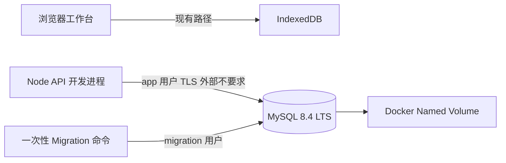

# MySQL 主库迁移 — Phase M1 架构冻结与实施任务书

> 状态：**架构冻结完成。允许数据 / Application / Repository 工程师实施 M1 MySQL 基础设施；不允许业务 Repository、前端切换或真实数据迁移。**
>
> 本文取代 SQLite 作为正式主库的长期迁移方向。SQLite 候选实现保留为既有实验 / 测试资产，不再继续投入主库切换工作；不得删除或破坏既有 IndexedDB 运行路径。

## 【技术结论：可行】

MySQL 适合作为 Knowledge_Base 的正式主库方向，前提是将它作为**单一服务端数据边界**，而不是把数据库连线暴露给浏览器：

```text
H5 浏览器工作台
→ Node API
→ MySQL 8.4 LTS
→ Docker named volume
```

M1 只验证 MySQL 基础设施、持久化、账号最小权限、版本化 Schema Migration、Node 连接池和健康检查。当前没有真实个人数据，故不以 IndexedDB → MySQL 导入作为 M1 阻塞项。

当前事实继续冻结：

```text
IndexedDB = 当前唯一运行主库
MySQL     = 候选主库，仅限开发与合成测试
SQLite    = 不再作为正式主库迁移目标；保留既有实验 / 测试资产
```

## 【推荐运行拓扑】

### M1 开发拓扑



M1 中，浏览器不访问 Node API 的业务数据接口，也不访问 MySQL：

```text
Browser → MySQL = 永久禁止
Browser → MySQL Driver = 永久禁止
Browser → API 业务数据 = M1 禁止
```

### 未来 Kubernetes 方向

Kubernetes 是后续部署与运维练习，不是 M1 交付。M1 只保留可演进边界：

```text
数据库配置全部来自环境变量
密码不进入镜像、源码或 Compose 文件
Migration 是独立一次性任务，不随 API 每次启动执行
API 使用最小权限 app 用户
持久化依赖外部挂载的 Volume / PVC，而非容器文件层
```

未来 K8s 采用 Secret、ConfigMap、StatefulSet / 托管 MySQL 等何种形态，必须新开架构评审；不得由 M1 Compose 文件直接推导成生产清单。

## 【MySQL 与 Driver 技术选型】

### 冻结选型

| 层 | 选型 | 冻结理由 |
|---|---|---|
| 数据库 | `mysql:8.4`（MySQL 8.4 LTS 系列） | LTS、官方镜像、InnoDB 与现代 utf8mb4 支持 |
| Node Driver | `mysql2` 3.x（Promise API） | 原生预编译 SQL、连接池、事务控制成熟；与 TypeScript 兼容 |
| ORM | 不引入 | 现有 Repository / Application 分层已明确；M1/M2 直接 SQL 维护成本更低 |
| Migration | 项目内 SQL migration runner | 版本可审计、无 ORM 隐式 DDL、可在 CI / 容器任务中独立执行 |

具体 patch 版本由 `pnpm-lock.yaml` 锁定；镜像在正式共享环境前应升级为 digest pin。M1 可以先使用 `mysql:8.4` LTS 标签，避免伪造未经验证的 digest。

### 数据库运行参数

冻结：

```text
engine                    = InnoDB
character-set-server      = utf8mb4
collation-server          = utf8mb4_0900_ai_ci
default-time-zone         = +00:00
transaction-isolation     = READ-COMMITTED
sql_mode                  = STRICT_TRANS_TABLES,ERROR_FOR_DIVISION_BY_ZERO,
                            NO_ENGINE_SUBSTITUTION
```

约束：

```text
所有时间以 ISO-8601 UTC 字符串或明确 UTC DATETIME(3) 写入；M2 必须统一一种表示。
所有业务写事务由 Repository 在同一 MySQL transaction 中完成。
不得依赖 MySQL 默认时区、隐式字符集或非严格模式修复脏数据。
```

M1 可先采用 `DATETIME(3)` + UTC 约定；M2 必须在第一条业务 Migration 前冻结所有已有字段的 MySQL 物理类型映射，不能由各 Repository 自行决定。

## 【Docker Compose 与持久化策略】

### 服务与网络

现有 `docker-compose.yml` 只有 `web` 服务。M1 不得改变其已有运行语义；应新增隔离 MySQL 服务，推荐命名：

```text
mysql
```

采用 Compose 默认私有网络或明确命名私有网络：

```text
knowledge-base-internal
```

M1 开发环境为让宿主机运行的 Node API / migration 命令连接 MySQL，可仅绑定回环端口：

```yaml
ports:
  - "127.0.0.1:3307:3306"
```

约束：

```text
禁止 0.0.0.0:3306:3306
禁止公网、局域网暴露
禁止把数据库端口写成可被前端读取或用户编辑的地址
未来 API 容器化后，优先移除宿主端口暴露，仅保留 Compose 内部网络访问。
```

### 持久化

必须使用 named volume：

```yaml
volumes:
  knowledge_base_mysql_data:
```

并挂载至官方镜像数据目录：

```text
/var/lib/mysql
```

禁止：

```text
匿名 volume
容器文件层存数据
将 MySQL datadir bind mount 到 Git 工作区
把 dump、volume、密码或真实数据提交 Git
```

M1 验收必须证明：

```text
写入测试数据
→ docker compose restart mysql
→ 同一数据仍存在
```

`docker compose down -v` 会主动删除数据卷，属于危险命令；不得写进日常启动、测试或恢复脚本。

### Compose healthcheck

MySQL 服务必须具有健康检查，推荐：

```text
mysqladmin ping
```

仅表示 server 已接受连接，不表示 Schema migration 已完成。API `/health` 的 ready 语义必须额外检查 app 用户连接与已迁移 Schema 版本，不能把 Compose container healthy 直接当成应用 ready。

## 【账号、权限与环境变量边界】

### 三类身份

| 身份 | 使用位置 | 权限边界 |
|---|---|---|
| `root` | 仅官方镜像首次初始化 | 不作为 API 或 migration 常驻账号；不写入应用连接串 |
| `knowledge_base_migrator` | 独立 migration 命令 / Job | 仅目标 database 的 DDL 与 migration 记录维护 |
| `knowledge_base_app` | Node API 连接池 | 仅目标 database 的 DML 与必要 transaction；无 DDL |

数据库名冻结：

```text
knowledge_base
```

### 精确授权

初始化脚本创建 database 后，按以下最小权限授权：

```sql
-- migration 用户：仅目标库，负责版本化 DDL
GRANT SELECT, INSERT, UPDATE, DELETE,
      CREATE, ALTER, DROP, INDEX, REFERENCES
ON knowledge_base.* TO 'knowledge_base_migrator'@'%';

-- app 用户：仅目标库业务读写
GRANT SELECT, INSERT, UPDATE, DELETE
ON knowledge_base.* TO 'knowledge_base_app'@'%';
```

明确禁止：

```text
GRANT ALL PRIVILEGES
GRANT OPTION
CREATE USER
PROCESS
FILE
SUPER / SYSTEM_USER
REPLICATION
全局 *.* 权限
app 用户执行 CREATE / ALTER / DROP / INDEX
root 或 migrator 作为 API 连接池身份
```

若 M2 需要 MySQL `TRIGGER`、`EVENT`、存储过程或 view，必须重新架构评审，不能静默扩大 migration 权限。

### 环境变量

本地真实配置：

```text
.env
```

只提交：

```text
.env.example
```

建议变量：

```text
MYSQL_DATABASE=knowledge_base
MYSQL_ROOT_PASSWORD=<replace-me>
MYSQL_MIGRATOR_USER=knowledge_base_migrator
MYSQL_MIGRATOR_PASSWORD=<replace-me>
MYSQL_APP_USER=knowledge_base_app
MYSQL_APP_PASSWORD=<replace-me>
MYSQL_HOST=127.0.0.1
MYSQL_PORT=3307
MYSQL_POOL_CONNECTION_LIMIT=10
```

Node API 仅接受结构化独立变量或 app-only connection string；migration runner 只接受 migrator 身份。不得让：

```text
浏览器读取 .env
前端 bundle 内嵌密码 / DSN
日志打印密码、完整 DSN 或 SQL 参数
Compose 文件保存真实密码
```

`.env`、`.env.local`、MySQL dump、volume、日志与备份文件须继续受 `.gitignore` 覆盖。M1 可新增明确的 MySQL data / dump 忽略规则，但不得以忽略规则替代 Secret 管理。

未来 K8s 中同名变量由 Secret 注入；ConfigMap 只放非敏感 host、database、pool limit 等配置。不得把 `.env` 直接转换、提交或复用为 Kubernetes Secret 清单。

## 【Schema v1 与 Migration 策略】

### Schema v1 范围

M1 建立完整的逻辑 Schema v1，以现有 Contracts 的九集合为唯一业务事实基线：

```text
items
item_status_events
reviews
methods
method_versions
method_evidence
method_applications
method_tombstones
item_links
schema_migrations
```

M1 只创建表、主键、唯一约束、外键策略、索引与 MySQL 物理类型映射；不实现业务 Repository 或将其接入任何运行路径。

关系约束必须延续既有可信边界：

- `ItemStatusEvent → Item`、`Review → Item`、`ItemLink → Review / Item` 可以使用硬外键；
- `MethodApplication → Item` 可使用硬外键；
- `Method` 永久清理后 Evidence / Application 仍须保留并由 Tombstone 解释，故 `MethodEvidence.methodId`、`MethodApplication.methodId` 不得设置会阻断方法正文清理的硬外键；
- `MethodVersion` 的历史关系与 Tombstone 语义不得由 CASCADE 误删；
- 禁止 `ON DELETE CASCADE` 代替 Application / Repository 的明确清理编排。

第一条 Migration 必须能从空数据库创建完整 v1 Schema：

```text
migrations/001_initial_schema.sql
```

后续命名冻结：

```text
NNN_lower_snake_case.sql
例如：002_add_xxx.sql
```

### `schema_migrations`

最小结构：

```text
version       INT PRIMARY KEY
name          VARCHAR(255) NOT NULL
checksum      CHAR(64) NOT NULL
applied_at    DATETIME(3) NOT NULL
```

Migration runner 规则：

```text
1. 以 migrator 用户连接。
2. 在执行前读取 schema_migrations。
3. 已执行版本：name 与 checksum 必须相同，否则失败，不重放。
4. 未执行版本：按版本升序执行。
5. 每一个 SQL migration 与其 schema_migrations 插入处于单一 transaction。
6. 任一 migration 失败：rollback、退出非零、不写成功记录。
7. 禁止修改已执行 migration 文件；新变更只新增版本。
8. 不由 API 启动时自动执行 migration。
```

MySQL DDL 的隐式提交是重要事实：并非所有 DDL 可回滚。因此 M1 初始建表 Migration 必须设计为可在空数据库重复安全检查；后续涉及破坏性 DDL 的 Migration 必须另行评审并有备份 / 演练策略。不得宣称 MySQL DDL 与业务事务具有相同 rollback 语义。

### Migration 并发与锁

M1 migration runner 必须以 MySQL advisory lock 串行化，例如：

```text
GET_LOCK('knowledge_base_schema_migration', 30)
→ 执行 migration
→ RELEASE_LOCK(...)
```

拿不到锁时失败退出，不并发执行，不重试式猜测。API 启动不持有该锁。

## 【Node API 与 Health Check 边界】

新增目录建议：

```text
apps/api/
packages/storage-mysql/
migrations/
```

职责：

```text
apps/api/
  HTTP server、环境变量校验、mysql2 pool 组合、/health
  M1 不提供业务 API

packages/storage-mysql/
  MySQL connection factory、transaction helper、migration runner 辅助、未来 Repository
  不由浏览器 import

migrations/
  版本化 SQL 文件；不放业务 TypeScript 代码
```

M1 API 必须使用 `knowledge_base_app` 的 `mysql2/promise` 连接池。建议池配置：

```text
waitForConnections = true
connectionLimit = MYSQL_POOL_CONNECTION_LIMIT（默认 10）
queueLimit = 0
connectTimeout = 明确有限值（例如 5000ms）
```

不记录完整连接 URI 或 password。

### `/health` 可信语义

M1 只实现：

```http
GET /health
```

成功条件必须同时满足：

```text
1. API 存活；
2. app 用户可从 pool 获取连接；
3. SELECT 1 成功；
4. database() = knowledge_base；
5. schema_migrations 中已达到当前 API 要求的最低版本（M1 为 001）。
```

成功：

```http
200
{
  "status": "ready",
  "database": "knowledge_base",
  "schemaVersion": 1
}
```

失败：

```http
503
{
  "status": "database-unavailable",
  "diagnosticId": "MYSQL_UNAVAILABLE" | "MYSQL_SCHEMA_NOT_READY",
  "message": "本地 MySQL 候选环境当前不可用"
}
```

禁止返回：

```text
密码、DSN、host、原始 MySQL error、SQL、stack、数据内容
```

M1 `/health` 是候选基础设施诊断，不是业务数据可用承诺；当前前端不调用它，数据库失败不会影响 IndexedDB 工作台。

## 【允许修改的文件或层】

M1 数据 / Application / Repository 工程师仅允许修改或新建：

```text
docker-compose.yml（仅新增或隔离 mysql 基础设施，不改变现有 web 语义）
.env.example
.gitignore
migrations/**
apps/api/**
packages/storage-mysql/**
package.json
pnpm-lock.yaml
pnpm-workspace.yaml（仅必要 workspace / onlyBuiltDependencies 配置）
tests/mysql-m1*.test.ts
docs/architecture/**
docs/daily-contributions/YYYY-MM-DD.md
```

禁止修改：

```text
apps/client/**
packages/storage-indexeddb/**
现有 Application Service 的运行组合
现有 Contracts 的业务语义
SQLite 既有实现（除文档标明其不再为主库候选外）
业务 Repository / 业务 API / 前端 HTTP Client
```

## 【明确禁止事项】

```text
IndexedDB → MySQL 真实迁移
IndexedDB / MySQL 双写
浏览器直连 MySQL
前端 bundle 使用 mysql2
root / migrator 作为 API 常驻连接用户
将密码、DSN、dump、volume 或真实数据提交 Git
MySQL 端口监听 0.0.0.0
Kubernetes、云端、账号、远程访问、同步或协作
将数据库不可用显示为“暂无事项”
API 自动执行 migration
```

## 【M1 验收标准】

M1 必须在干净开发环境实际验证：

1. `docker compose up -d mysql` 后 MySQL healthcheck 通过；
2. migration runner 以 migrator 用户执行 `001_initial_schema.sql`；再次执行无 DDL 重放、无额外 schema_migrations 记录；
3. checksum 或已执行 migration 内容不一致时 runner 明确失败；
4. app 用户能连接 `knowledge_base`、执行 `SELECT 1` 和必要 DML smoke test；
5. app 用户不能 `CREATE TABLE`、`ALTER TABLE`、`DROP TABLE`、访问其他 database 或管理用户；
6. API `/health` 使用 app pool 返回 `200 ready`；MySQL 未启动、密码错误、schema 未迁移时返回 `503 database-unavailable` 的脱敏 DTO；
7. 写入一个专用合成 smoke record，执行：
   ```text
   docker compose restart mysql
   ```
   后该 record 仍存在；
8. 所有测试 / 验收数据位于命名 Volume，不含真实个人数据；
9. `.env` 不被 Git 追踪，`.env.example` 无真实 Secret；
10. 项目工程验证：
    ```text
    typecheck
    test
    build:h5
    git diff --check
    ```

完成一轮工程验证后，必须追加更新：

```text
docs/daily-contributions/YYYY-MM-DD.md
```

## 【M2 前置条件】

只有 M1 经 QA 与架构复审通过后，才允许评审 M2。

M2 的最小目标是：

```text
MySQL Item / Review / Backup Repository 候选实现
现有 Contracts 等价测试
事务一致性与状态事件原子性
不接前端、不真实迁移、不双写
```

M2 开工前必须确认：

```text
Schema v1 与 Contracts 物理映射已冻结
migration runner 幂等性与权限边界可实证
app pool 不具备 DDL 权限
Volume 重启持久化已实证
health 能区分数据库不可用与 Schema 未就绪
```

## 【风险与保护策略】

| 风险 | 保护策略 |
|---|---|
| Compose 重建误删数据 | 使用 named volume；禁止日常使用 `down -v`；文档标记危险命令 |
| 密码泄露 | `.env` 忽略、example 占位符、日志脱敏、分离 app/migrator/root 身份 |
| app 误做 DDL | 分离账号；自动化验证 app DDL 被拒绝；API 不跑 migration |
| DDL 半执行 | 版本化 SQL、advisory lock、失败退出、破坏性 DDL 另审，不虚构 DDL rollback |
| 前端偷接候选库 | M1 不改 `apps/client/**`；浏览器永不使用 mysql2 |
| 双主数据漂移 | M1/M2 不迁移、不双写；IndexedDB 继续唯一运行主库 |
| K8s 预付复杂度 | M1 只保留 env / migration / volume 边界；不写 K8s 清单 |

## 【交付给数据 / Application / Repository 工程师的任务书】

```text
请只实施 MySQL M1 基础设施：

1. 增加隔离 MySQL 8.4 LTS Compose 服务、named volume、回环端口和健康检查；
2. 提供 .env.example、初始化脚本，创建 knowledge_base、migrator、app 三种最小身份边界；
3. 新增 migrations/001_initial_schema.sql、schema_migrations 与带 checksum / advisory lock 的 migration runner；
4. 新增 packages/storage-mysql：mysql2/promise app/migrator 连接工厂、pool / transaction 基础能力；
5. 新增 apps/api：仅环境校验、app pool 组合和 GET /health；
6. 补充真实 Compose / MySQL 定向测试或可重复 smoke 验证脚本，证明权限、幂等 migration、重启 Volume 持久化和 health 失败语义；
7. 不得实现任何业务 Repository、业务 HTTP API、前端、IndexedDB 迁移、双写或 K8s。

提交 QA 时必须列出：实际执行命令、Docker / MySQL 版本、测试输出、
未实现项及原因。每轮工程验证后更新当天 daily contribution。
```

## 【下一责任岗】

**数据 / Application / Repository 工程师。**

## 【是否允许写代码】

**允许，仅限 MySQL M1 基础设施、Schema v1、Migration runner、app pool、/health 与定向验证。禁止业务适配和前端切换。**
