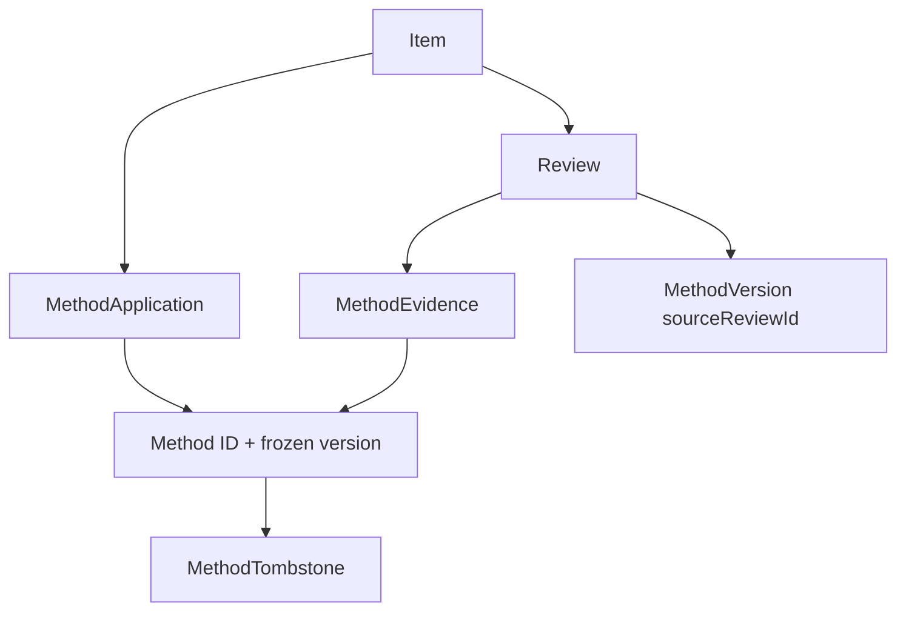

# SQLite 主库迁移 — S2 墓碑与事项永久清理裁决补充

> 状态：**架构裁决完成。S2 不得将 `MethodTombstone` 作为 Item 永久清理的独立阻断条件。S2 需补齐三类真实关联拒绝的完整零副作用测试后，回 QA 轻量复验；在复验通过前不得进入 S3。**
>
> 关联：`docs/architecture/SQLite主库迁移-S1稳定审阅与S2开工决策.md`。

## 【技术结论：可行，修正 S2 验收边界】

裁决：

```text
MethodTombstone
不直接参与 Item.purgeDeletedBefore() 的永久清理判断。
```

原因是当前墓碑模型和已冻结产品语义均不包含、也不应添加以下字段：

```text
MethodTombstone.itemId
MethodTombstone.reviewId
MethodTombstone.sourceReviewId
```

墓碑只承担方法本体已永久清理后，对既有 `MethodEvidence`、`MethodApplication` 冻结版本关系的最小历史解释责任：

```text
methodId
最后名称
permanentlyDeletedAt
最小版本映射
```

它不是事项、复盘或某一条证据的独立引用记录。不能因为数据库中存在任意墓碑，就阻止无关事项的回收站到期清理；这种全局耦合既不可信，也会让无关历史永久阻塞正常数据治理。

## 【一、正确的结构化依赖图】



`MethodTombstone` 只解释 `MethodRef`，并不回指某个 Item 或 Review。

因此：

```text
Item purge 的直接判断
= 待清理 Item 及其直接 / 可结构化追溯的关联事实

MethodTombstone 的保留与回收判断
= 剩余 MethodEvidence / MethodApplication 是否仍引用该 methodId
```

两者方向不同，不得混为一个“墓碑存在即拒绝 Item purge”的规则。

## 【二、S2 Item purge 的冻结判断】

S2 当前尚未实现方法生命周期清理编排。对待永久清理 Item，必须在同一 SQLite write transaction 内重新读取并按以下顺序判断：

### 可以在 S2 处理的路径

```text
Item 无方法相关引用
→ 清理该 Item 的 Review、ItemStatusEvent、ItemLink
→ 清理 Item
→ commit
```

这里的“无方法相关引用”指不存在下列三类真实结构化关系。

### 必须安全拒绝的三类真实关联

| 阻断记录 | 与待清理 Item 的结构化关系 | S2 行为 |
|---|---|---|
| `MethodApplication` | `method_applications.item_id = item.id` | 拒绝 |
| `MethodEvidence` | 待清理 Item 对应的 `Review.id = method_evidence.review_id` | 拒绝 |
| `MethodVersion.sourceReviewId` | 待清理 Item 对应的 `Review.id = method_versions.source_review_id` | 拒绝 |

任一存在时：

```text
throw "SQLite 方法关联清理尚未实施"
→ 整个 transaction rollback
```

不得：

```text
删除 MethodEvidence
删除 MethodApplication
清空 sourceReviewId
删除 MethodVersion
删除 MethodTombstone
删除 Item / Review 后遗留必填引用
将关系改连到其他方法、版本、复盘或事项
```

### 不属于 S2 独立判断条件

```text
任意 MethodTombstone 存在
→ 不阻断
```

`MethodTombstone` 只能通过其仍被 `MethodEvidence` 或 `MethodApplication` 引用这一**间接事实**与本次 Item 清理相关；这两类引用已经被前两项真实阻断条件覆盖。

## 【三、S3 的墓碑责任边界】

S3 实现方法生命周期后，才负责以下规则：

```text
Item purge 成功清理其最后一条 MethodEvidence / MethodApplication
→ 统计该 methodId 是否仍被任一存活 Evidence / Application 引用

仍有引用
→ 保留 MethodTombstone

无任何引用
→ 在同一可信 transaction 内删除对应 MethodTombstone
```

此规则是：

```text
引用清理完成后
→ 回收无引用墓碑
```

而不是：

```text
发现墓碑
→ 反向禁止 Item purge
```

S3 也不得通过标题、日期、当前版本号、文案或搜索结果推断墓碑与某 Item / Review 的关系。

## 【四、S2 必须补齐的定向测试】

此前“墓碑独立阻断”测试与数据模型不一致，必须删除或改写。不能把孤立墓碑插入视为 Item purge 拒绝证据。

### 1. 孤立墓碑不阻断无关联事项清理

新增正向测试：

```text
给数据库插入与目标 Item 无任何 Application / Evidence / Version source 关系的 MethodTombstone
→ 将无关联 Item 移入回收站并设为过期
→ purgeDeletedBefore()
→ Item 及其普通关联按 S2 无方法路径正常清理
→ 孤立 Tombstone 保持不变
```

这证明墓碑不会形成错误的全局阻断。

### 2. 三类安全拒绝的完整零副作用断言

针对每一类，使用**独立测试**，并在调用前后对所有相关记录拍摄深拷贝快照：

```text
A. MethodApplication.itemId = targetItem.id
B. MethodEvidence.reviewId = targetReview.id
C. MethodVersion.sourceReviewId = targetReview.id
```

每个测试必须断言抛出：

```text
SQLite 方法关联清理尚未实施
```

且调用前后下列集合逐字段完全一致：

```text
Item（目标及必要关联 Item）
Review
ItemStatusEvent
ItemLink
MethodEvidence
MethodApplication
MethodVersion
MethodTombstone
Method
```

这不是为了要求 S2 已实现方法清理，而是证明其“无法可信完成时拒绝”不会产生半成品。

### 3. `system_metadata` 断言修正

将现有仅检查 statement / row 是否存在的写法，替换为值断言：

```ts
expect(
  database.prepare("SELECT value FROM system_metadata WHERE key = 'migration-marker'").get(),
).toEqual({ value: 'yes' })
```

`replaceData()` 前后该值必须一致。不得只断言 Statement 对象、查询函数或记录是否 truthy。

### 4. BackupData 回滚保持

保留已有效的测试：

```text
九集合 replaceData
→ 最后一项 ItemLink 必填 Item 引用断裂
→ 整体 rollback
→ 既有 BackupData 不变
```

并把前后对比改为规范化的完整 `BackupData` 深比较，而非仅检查部分 Item 或数量。

## 【五、对 S2 任务书的替换文本】

原 S2 文档中任何把 `MethodTombstone` 与 `MethodEvidence`、`MethodApplication`、`MethodVersion.sourceReviewId` 并列为“Item purge 独立阻断条件”的表述，均由以下规则替代：

```text
S2 Item purge 的方法相关阻断条件只有：
- MethodApplication.itemId = targetItem.id；
- MethodEvidence.reviewId = targetReview.id；
- MethodVersion.sourceReviewId = targetReview.id。

MethodTombstone 不是独立阻断条件。
孤立墓碑不得阻断无关联事项清理。

若前三类任一存在：
拒绝并整体 rollback，直到 S3 实现完整方法生命周期清理编排。
```

## 【六、当前流转与授权】

当前不允许进入 S3。

允许数据层工程师仅修改：

```text
tests/sqlite-s2-p0.test.ts
或等价 S2 SQLite 定向测试文件
必要时 packages/storage-sqlite 中 purge 的错误分类 / 查询实现，
但只限对齐上述三类结构化阻断条件

docs/architecture/**
docs/daily-contributions/YYYY-MM-DD.md
```

不允许：

```text
实现方法生命周期清理
新增墓碑到 Item / Review 的字段或关系
把墓碑变成全局阻断器
开始 S3、HTTP、前端、真实迁移或主库切换
```

## 【交付给数据层工程师的技术约束】

```text
架构已裁决：MethodTombstone 不直接参与 Item 永久清理判断。

请只做 S2 P0 测试与实现对齐补修：
1. 删除“孤立 Tombstone 独立阻断 purge”的错误验收描述；
2. 增加“孤立 Tombstone 不阻断无关联 Item purge”的正向测试；
3. 对 MethodApplication、MethodEvidence、MethodVersion.sourceReviewId
   三类真实关联分别补齐完整零副作用快照断言；
4. 将 system_metadata 测试改为读取并断言实际 value；
5. 保留九集合 BackupData replaceData rollback 的完整深比较。

不得新增任何墓碑引用字段、方法生命周期实现、前端、API 或迁移逻辑。

完成后：
数据层工程师 → QA S2 轻量复验 → 架构师 S2 稳定审阅。
```
