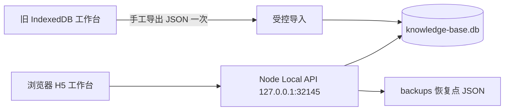

# SQLite 主库迁移 — S5 稳定审阅与 S6 分闸门实施任务书

> 状态：**S5 候选备份恢复层通过稳定审阅；允许启动 S6，但必须按本任务书的三个闸门顺序推进。**
>
> S6 开始前及任何未通过闸门期间：
>
> ```text
> IndexedDB = 当前唯一运行主库
> SQLite    = 候选存储，仅可使用临时合成数据
> ```

## 【技术结论：有条件可行，S5 封板并授权受控 S6】

S5 已证明：

```text
BackupDocument v1 / v2
→ BackupApplicationService.parseAndValidate()
→ SqliteBackupRepository.replaceData()
→ SqliteBackupRepository.exportData()
→ 九集合规范化后的事实等价
```

特别确认：断裂但可选的 `MethodVersion.sourceReviewId` 在解析时被保守移除，经 SQLite 恢复和导出后不回流；不伪造 Review，也不放宽任何必填关系的拒绝。

S6 不得被理解为“一次性切换 SQLite”。它必须被拆为三个强制闸门：

```text
S6-A：Local API 基础设施与 SQLite 运行保护
→ 架构 / QA 审阅
S6-B：前端 HTTP Client 切换与数据库不可用阻断页
→ 架构 / QA 审阅
S6-C：人工 JSON 迁移、恢复演练、重启 UAT、主库正式切换
→ 产品验收
```

未通过前一闸门，不得进入后一闸门。

## 【已确认的现状与迁移原则】

当前前端在：

```text
apps/client/src/pages/index/index.tsx
```

直接创建 `createIndexedDbRepository()`，并由浏览器内 Application Service 调用 IndexedDB Repository。S6 必须彻底替换该运行时主路径，而不是在浏览器中额外加一份 SQLite 或尝试长期双写。

最终运行拓扑冻结为：



最终数据边界：

```text
SQLite = 唯一可信主库
JSON   = 用户备份、恢复与一次性跨存储迁移格式
IndexedDB = 旧工作台的数据导出来源；新工作台不读、不写、不自动清除
```

## 【S6-A：Local API 基础设施与 SQLite 运行保护】

### 目标

新增单一 Node 进程：

```text
监听 127.0.0.1:32145
托管已构建 H5 静态文件
提供仅本机使用的 HTTP API
直接打开本机 SQLite 文件
```

建议新增独立 workspace，例如：

```text
apps/local-api/
```

不得用浏览器 bundle 引用 `better-sqlite3`，也不得在 `apps/client/**` 中直接 import `packages/storage-sqlite/**`。

### SQLite 文件、目录与启动

生产路径固定：

```text
%LOCALAPPDATA%\Knowledge_Base\knowledge-base.db
```

恢复点目录：

```text
%LOCALAPPDATA%\Knowledge_Base\backups\
```

启动规则：

1. 仅在目录不存在时创建目录；
2. 首次运行可创建空 SQLite 文件并完成 Schema v1；
3. 对既有文件，必须先打开、执行既有 `quick_check`；
4. `quick_check`、Schema migration、文件打开、目录创建或磁盘写入失败时：
   ```text
   拒绝启动数据服务
   保留原数据库文件
   不创建替代空库
   返回结构化 database-unavailable 错误及真实路径
   ```
5. API 只能监听：
   ```text
   host = 127.0.0.1
   port = 32145
   ```
   禁止 `0.0.0.0`、IPv6 / 局域网 / 公网监听和可配置远程 host。

### API 边界

API 只暴露现有 Application Contracts 的命令与读模型；不得向前端暴露 SQL、表名、任意查询、数据库路径写入或通用 CRUD。

推荐路径按业务资源分组，例如：

```text
GET /api/health
GET /api/bootstrap
POST /api/items
PATCH /api/items/:id/content
POST /api/items/:id/status
POST /api/items/:id/start-execution
POST /api/items/:id/delete
POST /api/items/:id/restore

POST /api/reviews/complete
GET /api/methods
POST /api/methods/:id/trash
POST /api/methods/:id/restore
POST /api/methods/:id/apply

GET /api/search
GET /api/dashboard
GET /api/trash
GET /api/backup
POST /api/backup/restore
```

最终路径命名可在实现中小幅调整，但必须：

```text
一个 API 请求 → 一个可信 Application / Repository 操作
不能让前端拼接跨表业务关系
不能绕过 BackupApplicationService.parseAndValidate()
```

S6-A 允许先提供最小 health 与数据库可用性响应，以及 API Service / Repository 组合；**不得开始前端切换或真实迁移。**

### S6-A 验收

必须至少证明：

```text
服务只监听 127.0.0.1:32145
正常打开临时 SQLite 文件后 health = ready
目录不可建 / DB 不可打开 / quick_check 失败 → database-unavailable
失败时不覆盖既有数据库、不创建伪空库
API 不启动时没有任何 IndexedDB fallback 逻辑
```

通过后：数据层 / API 工程师 → QA → 架构师，才可进入 S6-B。

## 【S6-B：前端 HTTP Client 与阻断页】

### 目标

前端从浏览器直连 IndexedDB 改为 HTTP 调用 Local API。不能让现有页面继续 new IndexedDB repository，也不能在页面中把 API 返回数据重新拼成底层存储关系。

推荐结构：

```text
apps/client/
→ API client（调用 127.0.0.1:32145/api/*）
→ 页面状态 / 交互

apps/local-api/
→ Application Service
→ SQLite Repository
→ SQLite 文件
```

必要时可在前端建立**同形的异步 API adapter**来承接既有 Application Service 调用，但 adapter 只应传递已定义 Contract 的请求与响应；不得引入前端 SQLite、Dexie 或多主库选择逻辑。

### 必须移除的运行时依赖

正式 H5 运行 bundle 不得：

```text
import @knowledge-base/storage-indexeddb
调用 createIndexedDbRepository()
读写 Dexie / IndexedDB
数据库不可用时创建空 IndexedDB
```

开发热更新入口可通过明确代理请求 Local API；它不是独立数据环境。

### 数据库不可用阻断页

以下情况必须显示全页阻断，而非空态：

```text
Local API 未运行
HTTP 请求不可达
API 返回 database-unavailable
SQLite quick_check / 打开失败
SQLite 迁移未完成
```

阻断页至少提供：

```text
明确状态：本地数据库未加载
API 地址：http://127.0.0.1:32145
数据库真实路径（若 API 可返回）
可行动建议：启动 Local API / 检查文件权限 / 从 JSON 备份恢复
重试按钮
```

禁止呈现为：

```text
暂无事项
首次使用
空工作台
自动创建新的浏览器库
```

### S6-B 验收

```text
前端正式 H5 不含 IndexedDB 运行路径
API 正常时现有闭环数据按 API 可信读模型呈现
API 未启动 / DB 不可用时显示阻断页
不渲染误导性空态
保存失败保留既有页面草稿
浏览器前端无法直接调用 SQLite
```

通过后：前端工程师 → QA H5 定向验收 → 架构师，才可进入 S6-C。

## 【S6-C：受控真实迁移、恢复演练与正式切换】

### 唯一允许的 IndexedDB → SQLite 迁移方式

```text
旧 IndexedDB 工作台
→ 用户主动导出完整 JSON 备份
→ 新 Local API 上传 JSON
→ BackupApplicationService.parseAndValidate()
→ 恢复前自动创建当前 SQLite JSON 恢复点
→ SQLite 单事务 replaceData()
→ 导出 SQLite JSON 并做规范化等价核验
→ 标记迁移完成
```

禁止 Node 自动扫描、读取或删除浏览器 IndexedDB profile。

### 恢复点

每次 API 执行 JSON 恢复前：

```text
导出当前 SQLite 完整 BackupDocument v2
→ 写 %LOCALAPPDATA%\Knowledge_Base\backups\before-restore-YYYY-MM-DDTHH-mm-ss.json
→ 成功后才允许 replaceData()
→ 仅保留最近 20 个自动恢复点，最旧优先删除
```

要求：

```text
恢复点写入失败 → 拒绝覆盖恢复
恢复点清理失败 → 不删除当前恢复点；记录明确告警
用户手工备份不纳入自动清理
.db 与 backups 均不得提交 Git
```

### 真实迁移失败与去重

```text
parseAndValidate 失败 → SQLite 不写入
恢复点失败 → SQLite 不写入
replaceData 失败 → SQLite transaction rollback
导出等价核验失败 → 保留 SQLite 与恢复点，拒绝标记迁移完成并显示可行动错误
```

SQLite 必须有不属于 `BackupData` 的基础设施元数据标记，例如：

```text
migration_completed_at
migration_source = json-import
```

该标记只在导入 + 等价核验成功后写入；普通 JSON 恢复不得覆盖它。

重复迁移策略冻结为：

```text
若 migration_completed_at 已存在
→ 默认拒绝再次执行“首次迁移”
→ 用户必须明确使用普通 JSON 恢复流程
```

这避免无意重复导入。不得通过“自动合并”处理两份数据。

### 重启和人工 UAT

正式切换前必须完成真实非测试数据的人工闭环：

```text
1. 在旧工作台导出 JSON；保留旧 IndexedDB 不动。
2. 在新 Local API 导入；检查导入后 SQLite JSON 等价核验成功。
3. 关闭 Local API 和浏览器；重启电脑。
4. 从 http://127.0.0.1:32145 打开新工作台。
5. 检查事项、复盘、方法版本、证据、应用、墓碑、回收站、content、startAction。
6. 执行一次用户主动 JSON 导出。
7. 执行一次恢复演练（先确认恢复点已生成）。
8. 再次重启并检查数据。
9. 只有上述都通过后，产品经理才可宣布 SQLite 为唯一主库。
```

旧 IndexedDB 不自动清理；只有用户完成上述核验和恢复演练后，才可自行清理浏览器旧数据。

## 【S6 全局禁止事项】

```text
长期双写 IndexedDB / SQLite
浏览器直接 SQLite / better-sqlite3
API 监听 0.0.0.0 或任何局域网 / 公网地址
账号、登录、权限、云端、同步、协作、远程数据库
Docker / Nginx 作为真实日常入口
把 DB 不可用伪装为空数据
自动删除 IndexedDB 或用户手工备份
提交 .db、JSON 备份或真实个人数据到 Git
```

## 【允许修改的层与文件范围】

### S6-A

```text
新增 apps/local-api/**
packages/storage-sqlite/**（仅运行初始化、错误映射、元数据能力）
package.json / pnpm workspace 配置（仅必要脚本与 workspace 声明）
tests/local-api-*.test.ts
```

### S6-B（仅 S6-A 审核通过后）

```text
apps/client/**
apps/local-api/**
tests/client-*.test.ts 或等价测试
```

### S6-C（仅 S6-B 审核通过后）

```text
apps/local-api/**
packages/application/**（仅恢复入口编排确有缺失时）
packages/storage-sqlite/**（仅迁移元数据与原子导入核验）
tests/local-api-migration*.test.ts
```

所有阶段可修改：

```text
docs/architecture/**
docs/daily-contributions/YYYY-MM-DD.md
```

## 【下一责任岗】

**数据 / Application / Repository 工程师（S6-A：Local API 基础设施）。**

## 【是否允许写代码】

**允许，但仅限 S6-A。禁止前端切换、真实迁移和主库切换，直到 S6-A 完成 QA 与架构复审。**
