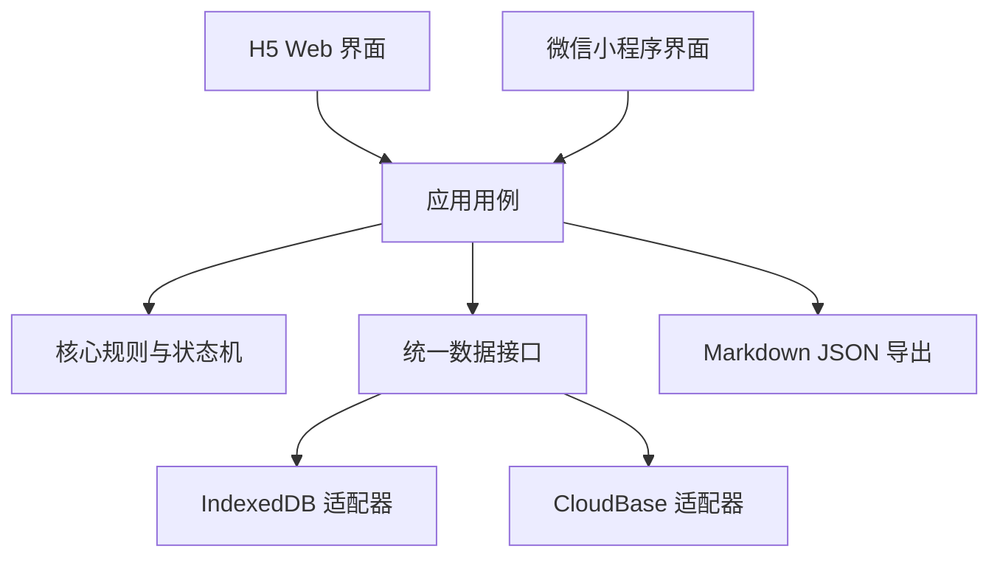

# 个人系统技术架构 v2

> 当前有效版本。v1 的 Next.js + SQLite 方案保留为历史草案，不再作为实施依据。

## 1. 当前技术决策

项目采用：

```text
Taro + React + TypeScript
├── 第一阶段：H5 / Web，本地运行
├── 第二阶段：H5 Docker 镜像部署
└── 后续阶段：微信小程序 + CloudBase
```

数据方案：

```text
第一阶段：IndexedDB
后续小程序：CloudBase
长期备份：Markdown + JSON + ZIP
```

核心目标不是“一套代码在所有平台完全不改”，而是尽量复用：

- 数据类型
- 状态流转规则
- 业务用例
- 数据校验
- 导入导出规则
- 大部分普通表单、列表和详情组件

平台专属能力必须放在适配层。

## 2. 为什么选择这条路线

### 符合当前顺序

1. 先在电脑本地跑通
2. 验证自己是否真的长期使用
3. 可以构建 Web 镜像部署
4. 后续较低成本进入微信小程序
5. 不要求初期购买公网服务器或维护数据库服务

### 接受的代价

- H5 能力不如纯 Next.js Web 自由
- 一些复杂 Web 组件无法直接用于小程序
- 跨端不等于零适配
- IndexedDB 不支持天然跨设备同步
- 微信云开发仍有平台规则、审核和用量成本

这些代价比后期完全重写小程序前端更可控。

## 3. 系统分层



### 界面层

负责：

- 页面展示
- 表单输入
- 触发应用用例
- 处理 H5 与小程序的布局差异

不允许页面直接调用 IndexedDB、`wx.cloud` 或数据库 API。

### 应用用例层

负责一个完整动作：

- 新建想法
- 将想法转为执行
- 结束执行并决定是否复盘
- 完成复盘
- 从复盘形成方法或新想法
- 导出和恢复数据

### 核心规则层

使用纯 TypeScript，不依赖 Taro、浏览器和微信 API。

负责：

- 状态机
- 输入校验
- 业务约束
- 实体和关联规则

### 数据接口与适配层

核心代码只依赖接口，例如：

```ts
interface ItemRepository {
  create(input: CreateItemInput): Promise<Item>
  getById(id: string): Promise<Item | null>
  list(query: ItemQuery): Promise<Item[]>
  update(id: string, input: UpdateItemInput): Promise<Item>
  changeStatus(id: string, status: ItemStatus): Promise<void>
}
```

第一阶段实现：

```text
IndexedDbItemRepository
```

后续实现：

```text
CloudBaseItemRepository
```

## 4. 运行与发布形态

### 本地开发

```text
pnpm install
pnpm dev:h5
```

浏览器访问本地开发地址，数据保存在该浏览器的 IndexedDB。

### 本地生产预览

```text
pnpm build:h5
pnpm preview:h5
```

用于验证正式构建产物。

### Docker 镜像

H5 构建完成后是静态文件。镜像采用两阶段构建：

```text
Node 构建阶段
→ pnpm 安装依赖
→ 构建 Taro H5

Nginx 运行阶段
→ 只复制静态产物
→ 提供 SPA 路由和静态文件服务
```

镜像不包含：

- 源代码以外的个人资料
- 浏览器 IndexedDB 数据
- 导出备份
- `.env` 密钥
- Gitee 凭据

建议命令：

```text
docker build -t kkk-personal-system:local .
docker run --rm -p 8080:80 kkk-personal-system:local
```

访问：

```text
http://localhost:8080
```

### Docker Compose

第一阶段只有静态 H5，可只包含一个 Web 服务。未来如果增加独立 API，再新增服务，不提前引入。

### 微信小程序

后续通过：

```text
pnpm dev:weapp
pnpm build:weapp
```

生成小程序产物，用微信开发者工具预览和发布。

## 5. Docker 的能力边界

Docker 解决的是：

- 构建环境一致
- 部署方式一致
- 不要求目标机器安装 Node.js
- 可以放到 NAS、云主机或本机运行

Docker 不会自动解决：

- 多设备数据同步
- 浏览器数据持久化迁移
- HTTPS 和公网域名
- 微信小程序云端数据

由于第一阶段数据在 IndexedDB 中，同一镜像从不同浏览器打开，各自拥有独立数据。完整导出和恢复仍然是 MVP 必须项。

## 6. 推荐 Monorepo 结构

```text
Knowledge_Base/
├── apps/
│   └── client/                    Taro 客户端
│       ├── src/
│       ├── config/
│       └── project.config.json
├── packages/
│   ├── domain/                    纯 TypeScript 业务规则
│   ├── contracts/                 类型和仓储接口
│   ├── validation/                Zod 校验
│   ├── storage-indexeddb/         H5 本地存储
│   ├── storage-cloudbase/         后续增加
│   └── export/                    Markdown + JSON 导出
├── tests/
├── docs/
├── Dockerfile
├── docker-compose.yml
├── nginx.conf
├── .dockerignore
├── package.json
├── pnpm-lock.yaml
└── pnpm-workspace.yaml
```

`Knowledge_Base` 自身就是独立 Git 仓库。它只管理项目代码和设计文档，不包含 `mikey` 下并列的个人资料目录。

## 7. 核心业务模型

业务模型沿用 v1：

- `items`：想法和执行是同一件事的不同状态
- `reviews`：复盘
- `methods`：当前有效的方法
- `method_evidence`：方法与复盘证据
- `item_links`：新想法的来源关系
- `events`：完整流转历史
- `tags`：轻量筛选

状态：

```text
idea_to_try            想试试
idea_later             当前不做未来想试试
doing                  进行中
paused                 暂停
waiting_review         待复盘
reviewed               已复盘
archived_no_review     不需要复盘的归档
abandoned              放弃
```

状态规则不依赖数据库和平台，必须由 `packages/domain` 中的测试覆盖。

## 8. IndexedDB 数据设计

第一阶段建议用 Dexie 封装 IndexedDB。

存储表与业务模型保持一致，并增加：

- `schemaVersion`：数据结构版本
- `deviceId`：为未来迁移和同步预留来源标识
- `deletedAt`：软删除
- `createdAt`、`updatedAt`：统一使用 ISO 时间

需要注意：

- 浏览器清理站点数据可能删除 IndexedDB
- 无痕模式不作为正式使用环境
- 用户必须能随时导出完整备份
- 重大数据升级前自动导出或提示备份

## 9. 导出与恢复

第一阶段将“灾难恢复”和“人类可读迁移”拆成两类能力，避免用低频的复杂导出阻塞核心数据安全。

### 9.1 第一阶段正式备份：完整 JSON

完整 JSON 是唯一恢复格式，至少包含：

- 格式版本、应用版本和导出时间
- 事项、复盘、方法及其版本
- 方法证据与方法应用
- 状态事件和事项来源关系

恢复流程：

1. 校验文件格式、版本、唯一 ID、状态和跨表引用
2. 生成当前数据的完整 JSON 安全备份并交付下载
3. 安全备份交付失败时终止恢复
4. 在单个 IndexedDB 事务中替换全部数据
5. 事务失败时回滚并保留原数据
6. 成功后重新读取数据并反馈结果

这一流程满足第一阶段“可完整导出、可可靠恢复”的工程标准。

### 9.2 后续可读导出：Markdown + ZIP

Markdown + ZIP 服务脱离应用阅读、迁移到外部知识库和长期人工归档，不作为恢复格式，也不阻塞第一阶段封板。出现明确使用需求后可按以下结构实现：

```text
KKK个人系统-时间戳/
├── README.md
├── manifest.json
├── data.json
├── Markdown 目录树/
└── export-report.json
```

`manifest.json` 可保存应用版本、数据 Schema 版本、导出时间、记录数量和数据格式版本。

## 10. Git 与仓库策略

远程仓库：

```text
https://gitee.com/liukai1304/my-notebook.git
```

只有 `mikey/Knowledge_Base` 是 Git 仓库：

```text
mikey/
├── Knowledge_Base/            Git 仓库：代码与项目设计
├── KKK个人知识库/             仓库外：个人资料
├── kkk自我价值/               仓库外：个人资料
├── mikey猎人特性（2.0）/      仓库外：个人资料
└── 朱宇思维/                  仓库外：个人资料
```

必须忽略：

- `node_modules`
- 构建产物
- 测试报告
- 本地缓存
- `.env` 和密钥
- 数据库文件
- IndexedDB 导出临时文件
- 个人数据备份 ZIP
- 日志

### 隐私边界

仓库本身不包含现有私人知识目录，但未来应用运行数据同样不能提交。提交前仍需检查暂存区：

```text
git status
git diff --cached
```

个人资料目录位于仓库边界之外，不会被本仓库的 Git 命令追踪。

## 11. 镜像版本策略

建议镜像标签：

```text
kkk-personal-system:dev
kkk-personal-system:0.1.0
kkk-personal-system:latest
```

Git 与镜像对应：

- 普通提交：只运行检查和测试
- `v0.1.0` 标签：构建版本镜像
- 主分支稳定版本：可额外标记 `latest`

第一阶段不必立即建立云端 CI；先保证本地命令稳定，再增加 Gitee Go 或其他流水线。

## 12. 第一阶段工程完成标准

- Windows 本地可运行 H5
- `pnpm build:h5` 可以稳定构建
- Docker 镜像可以构建并在本机访问
- 容器以非 root 或最小权限运行
- SPA 路由刷新不出现 404
- 镜像不包含密钥和个人运行数据
- 完整闭环可用
- 数据可导出并恢复
- H5 与未来小程序共享核心规则
- Git 仓库可追踪代码和设计文档，生成数据被正确忽略
