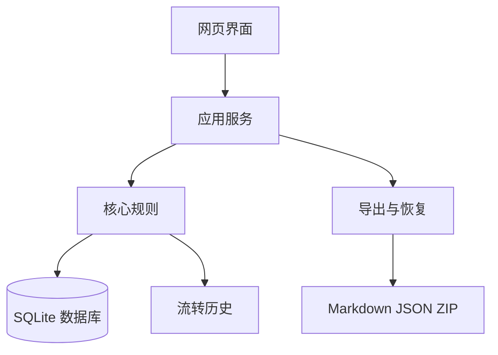
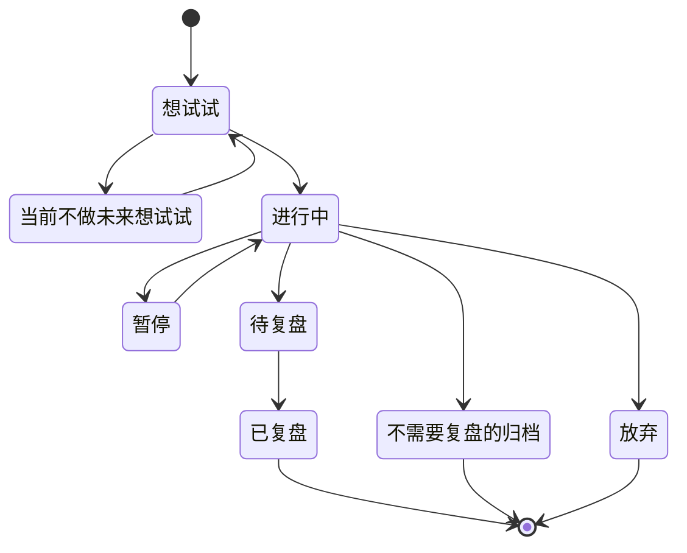

# 个人系统 Web 项目整体架构设计 v1

## 1. 项目要解决什么

这个项目不是把现有文件夹原样搬进网页，而是把个人系统中最重要的闭环做成可视化产品：

> 想法 → 执行 → 复盘 → 当前有效的方法 → 新想法

系统首先要回答五个问题：

1. 我有哪些想法还没决定是否执行？
2. 我现在正在做什么？
3. 哪些事情已经结束但还没复盘？
4. 我从实践中得到了哪些方法？
5. 一条想法是怎样一步步变成方法的？

## 2. 初期边界

### 第一版包含

- 单用户、本地使用
- 想法、执行、复盘、方法四个核心模块
- 总览、列表、详情、搜索、筛选
- 状态流转和历史记录
- Markdown + JSON 导出
- 数据库备份和恢复

### 第一版不包含

- 年、月、周计划
- AI
- 云同步
- 多用户
- 手机 App
- 自由画布
- 复杂统计
- 自动导入全部旧知识

这些内容不是永远不做，而是在核心闭环稳定以后逐步增加。

## 3. 最重要的架构原则

### 3.1 一件事只有一条主记录

想法进入执行、执行进入待复盘时，不复制文件和数据，只修改它的当前状态。

例如：

```text
idea_to_try → doing → waiting_review → reviewed
```

这样可以避免同一件事同时存在三个版本，也能完整展示流转历史。

### 3.2 方法和复盘是独立记录

复盘保存“发生了什么、为什么得到这个结论”；方法保存“我现在具体怎么做”。

一个方法可以关联多次复盘，一次复盘也可以产生多个方法或新想法。

### 3.3 数据库是运行数据，导出文件是长期资产

- 应用运行时，以数据库为准
- Markdown + JSON 用于迁移、阅读和长期备份
- 初期不做数据库和 Markdown 双向实时同步，避免双重真相

### 3.4 所有重要变化可追溯

以下操作都写入事件历史：

- 状态变化
- 创建或完成复盘
- 创建或更新方法
- 暂停、恢复、放弃
- 重要字段修改

### 3.5 先做模块化单体，不做微服务

这是单用户个人系统。微服务会增加部署、通信、日志和数据一致性成本，没有初期收益。

第一版使用一个 Web 应用、一个数据库和一个导出目录即可。

## 4. 推荐技术方案

### 默认方案

| 层 | 建议技术 | 原因 |
|---|---|---|
| Web 全栈框架 | Next.js + TypeScript | 前后端同一项目，生态成熟，适合快速迭代 |
| UI | Tailwind CSS + shadcn/ui | 组件可控，适合做表单、看板和管理界面 |
| 数据库 | SQLite | 本地单用户、零运维、备份简单 |
| ORM | Drizzle ORM | Schema 清晰、迁移可控、接近 SQL |
| 表单校验 | Zod | 前后端共用数据规则 |
| 测试 | Vitest + Playwright | 单元测试与关键用户流程测试 |
| 包管理 | pnpm | 安装快、依赖管理清楚 |
| 导出 | 服务端生成 Markdown + JSON + ZIP | 数据可读、可迁移、可校验 |

### 为什么不用一开始前后端分离

初期只有一个开发者、一个用户和一个部署单元。前后端分离会增加：

- 两套项目配置
- API 契约维护
- 跨域和认证处理
- 两套部署流程

等产品边界稳定，真有移动端或公开 API 需求时，再拆分也不迟。

### 为什么选择 SQLite

- 数据是个人本地资产
- 单文件方便备份
- 不需要启动独立数据库服务
- 支持事务、索引和关系查询
- 未来可迁移到 PostgreSQL

## 5. 系统结构



### 网页界面

负责：

- 总览
- 表单
- 列表和筛选
- 详情和时间线
- 状态流转操作

### 应用服务

负责组织一个完整用例，例如：

- 创建想法
- 开始执行
- 结束执行并决定是否复盘
- 完成复盘并生成方法
- 导出全部数据

### 核心规则

负责保证：

- 不允许从错误状态跳转
- 复盘必须来自执行过的事项
- 已归档事项不能继续修改，除非先恢复
- 方法和证据关联有效
- 删除操作不会破坏历史关系

### 数据层

负责：

- 数据保存
- 查询和事务
- 数据库迁移
- 备份和恢复

## 6. 核心业务模型

第一版不建议为“想法”和“执行”创建两张完全独立的表。它们是同一事项的不同状态。

### `items`：事情的主记录

| 字段 | 含义 |
|---|---|
| id | 唯一标识，建议 UUID |
| title | 标题 |
| content | 详细内容，Markdown |
| status | 当前状态 |
| source_type | 直接创建、复盘产生、方法产生 |
| goal | 当前阶段做到什么算结束 |
| next_action | 下一步 |
| review_at | 检查日期 |
| stop_condition | 停止条件 |
| created_at | 创建时间 |
| updated_at | 更新时间 |
| completed_at | 执行结束时间 |
| archived_at | 归档时间 |

第一版状态建议：

```text
idea_to_try            想试试
idea_later             当前不做未来想试试
doing                  进行中
paused                 暂停
waiting_review         待复盘
reviewed               已复盘
archived_no_review     不需要复盘的归档
abandoned              放弃
```

### `reviews`：复盘

| 字段 | 含义 |
|---|---|
| id | 唯一标识 |
| item_id | 来源事项 |
| actions_taken | 实际做了什么 |
| outcome | 结果怎样 |
| worked | 哪些有效或舒服 |
| did_not_work | 哪些不兼容 |
| reasoning | 原因判断 |
| next_adjustment | 下次怎么调整 |
| summary | 核心结论 |
| created_at | 创建时间 |
| completed_at | 完成时间 |

### `methods`：我的做事方法

| 字段 | 含义 |
|---|---|
| id | 唯一标识 |
| title | 方法名称 |
| content | 当前方法，Markdown |
| applies_when | 适合情况 |
| not_for | 不适合情况 |
| validation_count | 验证次数 |
| version | 当前版本 |
| created_at | 创建时间 |
| updated_at | 更新时间 |
| archived_at | 停用时间 |

### `method_evidence`：方法与复盘的证据关联

| 字段 | 含义 |
|---|---|
| method_id | 方法 |
| review_id | 支持该方法的复盘 |
| note | 这次复盘提供了什么证据 |

### `item_links`：事项之间的来源关系

用来表示：

- 某条新想法来自哪次复盘
- 某条新想法来自哪个方法
- 某个事项由哪个旧事项拆分出来

### `events`：流转历史

| 字段 | 含义 |
|---|---|
| id | 唯一标识 |
| entity_type | item、review、method |
| entity_id | 对应记录 ID |
| event_type | created、status_changed、updated 等 |
| from_value | 变化前 |
| to_value | 变化后 |
| note | 备注 |
| created_at | 发生时间 |

### `tags` 与关联表

用于轻量分类。标签不是主流程，不允许用大量标签替代清晰状态。

## 7. 状态流转规则



关键约束：

1. 只有执行过的事项可以进入待复盘。
2. 待复盘必须完成复盘后才能成为已复盘。
3. 已复盘不等于一定形成方法。
4. 方法不属于事项状态，而是从复盘中提炼出的独立资产。
5. 方法和复盘都可以产生新想法。

## 8. 第一版页面

```text
/
├── dashboard                总览
├── items
│   ├── ideas                想法与待验证
│   ├── doing                正在做的事
│   ├── reviews              待复盘与已复盘
│   └── [id]                 一件事的详情和时间线
├── methods                  我的做事方法
│   └── [id]                 方法详情和证据
├── search                   全局搜索
└── settings
    ├── export               导出
    ├── backup               备份与恢复
    └── data                 数据说明
```

## 9. 导出结构

建议导出为 ZIP：

```text
KKK个人系统-2026-07-18/
├── README.md
├── manifest.json
├── data.json
├── 10-我的做事方法/
├── 20-正在做的事/
│   ├── 01-进行中/
│   └── 02-不需要复盘的归档/
├── 30-复盘/
│   ├── 01-待复盘/
│   └── 02-已复盘/
├── 40-想法与待验证/
│   ├── 01-想试试/
│   └── 02-当前不做未来想试试/
└── export-report.json
```

其中：

- Markdown 供人和 AI 阅读
- `data.json` 保存完整结构和关联
- `manifest.json` 保存导出版本和系统版本
- `export-report.json` 保存数量、校验和错误

恢复时以结构化 JSON 为主，Markdown 作为可读备份。

## 10. 年、月、周计划以后怎样接入

计划模块后续新增：

- `plans`：计划本身，类型为 year、month、week
- `plan_relations`：年、月、周之间的父子关系
- `plan_items`：计划与执行事项的关联

关键原则：

> 同一个执行事项只保留一份，通过关联进入不同计划，不在年、月、周各复制一份。

例如“学习瘦金体”是一条 `item`，它可以同时关联：

- 2026 年计划
- 2026 年 7 月计划
- 7 月第 3 周计划

计划只负责安排和观察，不负责复制事项正文。

## 11. 建议项目代码结构

```text
personal-system/
├── src/
│   ├── app/                 页面和路由
│   ├── components/          通用界面组件
│   ├── features/
│   │   ├── items/           想法与执行
│   │   ├── reviews/         复盘
│   │   ├── methods/         做事方法
│   │   ├── search/          搜索
│   │   └── export/          导出与恢复
│   ├── domain/              状态机和核心规则
│   ├── db/                  Schema、查询、迁移
│   ├── lib/                 通用工具
│   └── styles/
├── tests/
│   ├── unit/
│   ├── integration/
│   └── e2e/
├── data/                    本地数据库，不提交 Git
├── exports/                 导出文件，不提交 Git
├── drizzle/
├── docs/
└── package.json
```

按业务功能组织代码，不按 `controllers/services/utils` 无限横向分层。

## 12. 安全与数据保护

初期也必须做到：

- 数据库文件和导出内容不提交公开 Git
- 默认只监听本机地址
- 富文本或 Markdown 渲染必须防止脚本注入
- 导入文件限制大小并校验格式
- 恢复备份前自动备份当前数据库
- 删除默认使用软删除或二次确认
- 数据库迁移前自动备份

## 13. 架构决策记录

后续每个会影响长期维护的决定，都在 `项目设计/架构决策记录/` 新建一份短文档，例如：

```text
ADR-001-使用SQLite作为初期数据库.md
ADR-002-事项使用单表状态流转.md
ADR-003-导出采用Markdown加JSON.md
```

每份只回答：背景、选择、为什么、代价、何时重新评估。

## 14. 需要在编码前确认的产品问题

以下问题不阻塞架构草案，但进入 UI 和数据库实现前需要逐项确认：

1. 第一版是否只在 Windows 本机使用？
2. 正文是否使用 Markdown 编辑器？
3. 删除是否统一使用回收站？
4. 是否需要附件和图片？第一版可暂缓。
5. 是否需要每天的执行日志，还是只更新事项当前情况？
6. “放弃”是否允许以后恢复？建议允许。
7. 数据是否包含高度私密内容？这会影响未来的加密方案。

## 15. 第一版架构成功标准

- 核心流转规则能由单元测试覆盖
- 数据库升级不会丢数据
- 一条事项的完整历史可查询
- 方法能够追溯到复盘证据
- 完整数据可以导出并恢复
- UI 层替换时不会破坏核心业务规则
- 后续加入计划模块不需要复制或推翻事项模型
