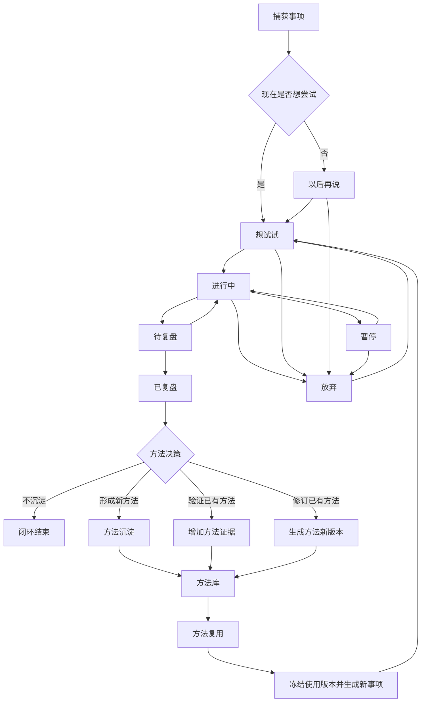
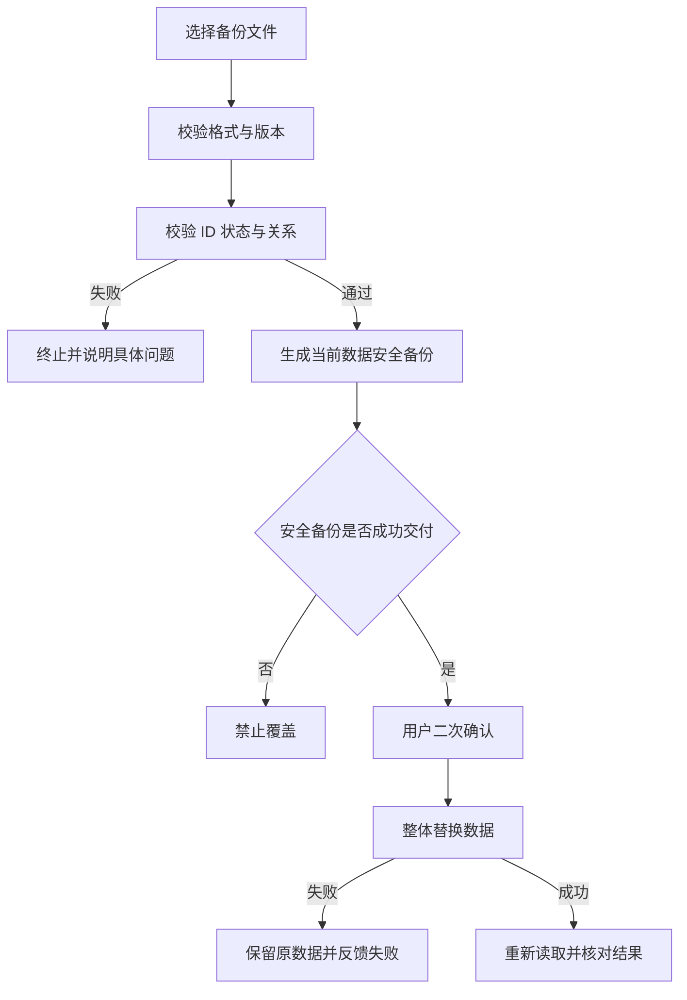

# 产品经理工作基线 v1

> 状态：当前有效的产品管理与跨岗协作基线，已同步至 Layout Sprint 2 封板行为。
>
> 产品功能事实以 `功能清单-v3.md` 和已验收行为为准；技术事实以 `整体架构设计-v2.md` 为准。本文件负责统一目标、业务闭环、产品口径、差距、迭代顺序和验收边界，不设计数据库表、不定义具体技术实现。

## 一、产品经理定位

### 核心定位

产品经理是 Knowledge Base 的核心业务统筹岗，负责定义产品全部业务逻辑、闭环流程、产品需求与验收标准，并协调架构、前端、后端和测试完成交付。

产品经理对以下结果负责：

1. 用户能否低阻力捕获一个真实事项。
2. 同一事项能否通过状态迁移完成行动与复盘，而不复制主记录。
3. 复盘证据能否按需沉淀为可追溯、可修订、可复用的方法。
4. 方法能否冻结实际使用版本并发起新事项，形成复利闭环。
5. 用户能否通过搜索和观察定位堵塞，而不是只积累数据。
6. 全部核心数据能否完整导出、可靠恢复且不被系统锁死。
7. AI 是否服务判断与闭环，而不是替用户编造事实或制造额外负担。

### 职责范围

- 业务闭环：维护流程图、状态语义、流转规则、异常分支和完成标准。
- 数据模型需求：定义业务对象、字段语义、关系、生命周期和审计要求。
- AI 产品需求：定义输入、输出、触发条件、用户确认、失败降级和隐私边界。
- 页面与交互：输出页面原型、信息层级、表单字段、搜索和定位规则。
- 数据安全：定义导出、校验、恢复、安全备份和用户反馈规则。
- 跨岗协调：向架构输出模型约束，向研发输出页面与能力需求，向测试输出验收场景。
- 迭代治理：维护优先级、依赖关系、不做清单和版本封板标准。

### 边界红线

产品经理不承担以下工作：

- 不设计数据库表、索引和具体 Schema。
- 不编写或实现接口。
- 不写前端页面或样式。
- 不写 Docker、部署和运维脚本。
- 不调试代码 Bug。
- 不替架构师决定技术框架和存储实现。

产品经理可以定义“业务必须保存什么、操作必须保证什么、用户必须看到什么”，但不得越界指定“具体如何编码实现”。

## 二、北极星与产品原则

### 北极星闭环

```text
真实想法被捕获
→ 转化为有限行动
→ 产生复盘证据
→ 证据沉淀或修订当前有效方法
→ 方法被真实复用
→ 新行动产生新证据
```

产品价值不以“记录总量”衡量，而以闭环质量衡量：

- 有多少事项真正进入行动。
- 有多少行动完成复盘。
- 有多少方法拥有真实证据。
- 有多少方法被复用后再次完成复盘。
- 系统是否减少遗忘、悬而未决和重复踩坑。

### 产品原则

1. **一事一记录**：想法、行动、暂停、待复盘和已复盘是同一事项的生命周期，不复制事项。
2. **证据优先**：复盘是事实层，方法是基于事实形成的当前判断；不强制沉淀方法。方法来源事项进入待复盘时可默认建议验证来源方法，但用户始终可取消或改选。
3. **方法可演化**：方法必须有版本、证据、验证次数和实际使用快照。
4. **行动优先于整理**：表单和分类不能比行动本身更重。
5. **本地优先与数据主权**：无外部服务时核心闭环仍可使用；用户可完整带走和恢复数据。
6. **AI 辅助不代决策**：AI 可以提取、分析、匹配和总结，但不得未经确认写入事实、复盘或方法资产。
7. **观察服务下一步**：仪表盘只展示能帮助判断堵塞、证据和复利的信息。
8. **先验证再扩张**：同类摩擦重复出现并有证据后再增加字段、分类或自动化。

## 三、业务对象与语义

> 本节定义产品需要表达的业务信息，不等同于数据库表设计。

### 1. 事项

代表一件从想法进入行动、最终产生结果的主记录。

产品必须表达：

- 唯一身份。
- 一句话标题。
- 补充说明。
- 当前状态。
- 创建、更新和软删除时间。
- 状态迁移历史。
- 是否来源于某条复盘产生的新想法。
- 是否来源于某个方法及实际使用的方法版本。
- 对应复盘（若已产生）。

### 2. 复盘记录

代表某次行动结束后的事实、感受、阻力和新判断。

产品必须表达：

- 所属事项。
- 结果怎样（默认唯一必填文本）。
- 有效 / 舒服的观察（用户勾选后必填）。
- 阻力 / 不舒服的观察（用户勾选后必填）。
- 新想法（用户勾选后必填，并在确认后生成新事项）。
- 创建和更新时间。
- 本次是否不处理方法、形成方法、验证方法或修订方法。两项均未选择即不处理方法；“不处理方法”不是第三个显式操作。

红线：AI 不得把推测写成用户实际发生的结果。

### 3. 方法库

代表当前有效、可复用且可由证据修订的行动方法。

产品必须表达：

- 方法名称。
- 当前可执行步骤。
- 补充说明。
- 当前版本。
- 历史版本。
- 验证次数。
- 来源与后续复盘证据，以及其结构化关系类型：形成、验证、修订或历史关系未知。
- 每次真实应用时冻结的版本快照。
- 由该方法发起的事项及其后续复盘情况。

方法名称取步骤首行；修订时沿用方法身份，不创建无关的新方法。验证表示新增支持或反驳证据但不改变步骤；修订表示形成新版本。

### 4. 状态事件日志

代表事项生命周期中的不可缺失审计记录。

产品必须表达：

- 所属事项。
- 原状态与目标状态。
- 发生时间。
- 触发动作语义。

恢复、导入和未来迁移后，时间线必须仍可解释事项如何到达当前状态。

### 5. 仪表盘统计

当前基础事实指标：

- 新增事项数。
- 进入执行次数。
- 完成复盘数。
- 方法形成数。
- 方法验证数。
- 方法修订数。
- 方法发起行动数。
- 当前想试试、进行中、暂停、待复盘和以后再说存量。
- 方法复用后尚未完成复盘的事项数。

所有指标必须：

1. 共享同一时间窗口口径。
2. 可下钻到构成该数字的具体事项、复盘或方法。
3. 区分“次数”和“去重对象数”。
4. 不用无证据的分数评价用户表现。

## 四、完整业务闭环与状态口径

### 1. 总闭环



### 2. 必须纠正的概念

“方法沉淀”和“方法复用”不是事项状态，而是复盘决策与方法应用行为。事项状态机只描述一件事项当前处于哪里；方法闭环通过事项、复盘、方法、证据和应用关系共同表达。

因此，用户提出的：

```text
捕获事项 → 想试试 → 进行中 → 暂停 → 待复盘 → 已复盘
→ 方法沉淀 → 方法复用生成新事项
```

应作为**端到端业务主路径**，不能全部塞进同一个状态枚举。

### 3. 当前事项状态

| 产品状态 | 含义 | 主要可去向 |
|---|---|---|
| 想试试 | 已捕获且进入近期考虑池 | 进行中、以后再说、放弃 |
| 以后再说 | 当前不投入，未来可重新考虑 | 想试试、放弃 |
| 进行中 | 已开始真实行动 | 暂停、待复盘、不复盘归档、放弃 |
| 暂停 | 暂时停止但未结束 | 进行中、放弃 |
| 待复盘 | 行动已结束，等待形成事实记录 | 已复盘、返回进行中 |
| 已复盘 | 已完成该事项复盘 | 终态；可产生方法或新事项 |
| 不复盘归档 | 明确结束且不需要复盘 | 终态 |
| 放弃 | 明确停止投入 | 可重新进入想试试 |

### 4. 状态语义待决策

当前产品允许“进行中 → 不复盘归档”，但 `功能清单-v3.md` 的完成标准更强调行动结束后进入待复盘。该分支会削弱“复盘优先”的北极星，需要通过真实使用数据决定：

- 保留为低频例外，并要求用户主动确认；或
- 第二阶段取消该分支，所有完成行动统一进入待复盘。

在决策前，不擅自改变现有行为。

## 五、页面与交互基线

一级信息架构：

```text
全局：搜索、快速捕获
业务：行动、方法、观察
治理：数据与设置
```

页面责任：

- **行动**：捕获、筛选、查看、推进和复盘事项。
- **方法**：搜索、比较、查看证据与版本，并用方法发起行动。
- **观察**：切换周期、发现堵塞、查看方法复利并下钻。
- **数据与设置**：查看本地数据状态、导出和恢复。

交互共识：

1. 桌面端采用一级导航 + 顶部全局栏 + 主工作区。
2. 行动和方法采用“列表负责定位，详情负责理解和操作”。
3. 复盘属于事项详情，不创建第二条事项主记录。
4. 历史、证据和危险操作默认降级或折叠。
5. 搜索结果必须跨模块精准定位，而不是仅显示文本结果。
6. 移动端改为空间推进，但业务对象和闭环不变。
7. 快速捕获成功后清空并收起；取消不得产生数据。

详细低保真布局以 `整体布局设计-v1.md` 为基线，Layout Sprint 1 与 Sprint 2 已完成其桌面端工作台、方法详情和流转历史抽屉的冻结范围。

## 六、搜索逻辑

### 搜索范围

- 事项标题与补充说明。
- 复盘结果、有效观察、阻力观察和新想法。
- 当前方法名称、步骤和补充说明。
- 方法历史版本内容。

### 结果组织

结果按业务对象分组：事项、复盘、方法。每条结果至少展示对象类型、标题、命中摘要和必要状态 / 版本信息。

### 定位规则

- 事项：进入行动模块，清除不兼容筛选，选中事项。
- 复盘：进入行动模块，选中所属事项并定位复盘区域。
- 当前方法：进入方法模块并选中方法。
- 历史方法版本：进入方法模块、选中方法并展开命中版本。
- 回收站事项：必须明确标识已删除状态，不与有效事项混淆。

## 七、备份与恢复规则

完整 JSON 是正式灾难恢复格式，必须覆盖事项、复盘、方法、方法版本、方法证据、方法应用、状态事件和来源关系，并携带格式版本、应用版本和导出时间。

恢复业务流程：



验收红线：

- 安全备份交付失败时不得覆盖当前数据。
- 替换失败不得留下半恢复状态。
- 恢复后关联、版本快照和事件历史不得丢失。
- Markdown / ZIP 是未来可读导出，不承担灾难恢复职责。

## 八、AI 产品能力边界

AI 属于闭环增强层，不阻塞核心本地闭环。任何 AI 能力必须具备：明确触发、来源引用、用户确认、可编辑、可拒绝、失败降级和隐私说明。

### 1. 灵感自动提取

目标：从用户主动提供的文本中提取候选事项，降低捕获成本。

输出：候选标题、候选补充说明、来源片段。

规则：

- 默认只生成草稿，不自动入库。
- 多个灵感必须逐条确认或批量勾选。
- 不把抽象观点强行改写为行动。
- 保留来源上下文，避免断章取义。

### 2. 复盘智能分析

目标：帮助用户从已填写复盘中识别有效因素、阻力、矛盾和下一次可验证假设。

输出：事实摘要、模式候选、缺失信息提示、下一次实验建议、候选方法动作。

规则：

- 明确区分“用户事实”“AI 推断”“建议”。
- 不自动完成复盘，不自动把建议沉淀成方法。
- 必须引用对应复盘原文。

### 3. 方法智能匹配推荐

目标：在创建或准备执行事项时，从现有方法库推荐可能适用的方法。

排序因子产品要求：语义相关性、历史验证证据、复用后的复盘完成情况、当前版本新鲜度。

输出：推荐方法、推荐理由、相关证据、版本信息和不确定性。

规则：

- 用户选择后才建立方法应用关系。
- 实际应用必须冻结当时版本。
- 不因验证次数高就忽略适用上下文。

### 4. 周期数据 AI 总结

目标：基于选定时间窗口总结事实、堵塞、方法复利和待验证假设。

输出结构：

1. 周期事实。
2. 主要堵塞。
3. 有证据的方法变化。
4. 未闭环事项。
5. 下一周期可选关注点。

规则：

- 每条结论可下钻到来源记录。
- 不输出人格评判和无数据支撑的绩效分数。
- 相同数据输入应使用一致指标口径。

### AI 上线前置条件

1. 第一阶段核心闭环已稳定封板。
2. 完成至少 2—4 周真实使用验证。
3. 明确 AI 提供方、本地 / 云端处理方式、费用、密钥和隐私边界。
4. 建立用户确认与撤销机制。
5. 无 AI 或 AI 失败时，手工流程仍完整可用。

## 九、项目现状审计（已同步至 Layout Sprint 2 封板）

### 已成立

- `v0.1.0` 已封板并位于主分支。
- 想法、执行、暂停 / 恢复、待复盘、已复盘主闭环已实现。
- 复盘产生新想法，形成 / 验证 / 修订方法已实现。
- 方法版本、证据、验证次数和方法应用快照已有业务表达。
- 方法可发起新事项。
- 全局搜索、状态事件时间线、周期仪表盘与下钻已实现。
- 回收站与 30 天保留规则已实现。
- 完整 JSON 备份、安全恢复和关联校验已实现。
- Domain / Application / Repository 分层骨架成立。

### 尚未成立

- Layout Sprint 1 已实现四模块应用骨架、一级导航、顶部全局栏与跨模块定位。
- Layout Sprint 2 已实现方法列表—详情工作台、方法局部搜索、来源与验证证据读模型呈现、来源方法复盘建议与流转历史右侧抽屉。
- AI 灵感提取、复盘分析、方法推荐和周期总结尚未进入当前有效范围。
- 第二阶段方向层、阶段目标和年月周计划尚未定义正式需求。
- Markdown + ZIP 可读导出尚未由真实需求触发。

### 文档口径漂移

1. `开发流程-v1.md` 仍引用早期字段和早期 Markdown + JSON 范围，不能作为当前功能事实。
2. `整体架构设计-v2.md` 仍列出标签和 `deviceId` 预留，但当前产品基线明确将其延后。
3. 实际契约仍保留早期复盘与方法字段，当前页面通过默认值兼容；后续不能把这些技术兼容字段误当作当前产品表单需求。
4. README 的“第一阶段收口中”和 Git 中已存在 `v0.1.0` 标签及 Layout Sprint 2 封板状态可能存在阶段表述差异，应在下一次文档治理时统一。

治理规则：当文档冲突时，先由产品经理确认产品语义，再由架构师评估兼容和迁移，不允许研发自行按旧字段扩展页面。

## 十、迭代路线图

### P0：产品口径冻结与真实使用验证

目标：证明 `v0.1.0` 不只是代码闭环，而是 KKK 愿意长期使用的闭环。

范围：

- 统一状态、字段和版本口径。
- 使用真实数据连续运行 2—4 周。
- 记录捕获、推进、复盘、方法回看和备份中的摩擦。
- 同类摩擦至少重复出现三次再转需求。
- 决定“不复盘归档”是否继续保留。

验收：形成真实使用报告、摩擦清单和有证据的下一版本优先级。

### P1：长期工作台布局重构

目标：从功能演示长页面升级为日常工作台。

顺序：

1. 应用骨架：行动、方法、观察、数据与设置。
2. 方法列表—详情与跨模块定位。
3. 顶部搜索、紧凑捕获、视口工作区和响应式。

约束：不改变现有业务规则、核心数据语义和备份格式。

验收：所有 v0.1.0 能力仍可达；高频操作不依赖长页面滚动；搜索与下钻能跨模块精准定位。

### P2：观察与产品健康度增强

目标：让用户快速识别未闭环事项和方法复利，而不是增加装饰性图表。

候选范围：

- 闭环转化事实：捕获 → 执行 → 复盘。
- 待复盘时长与暂停时长分布。
- 方法应用 → 完成复盘的闭环率。
- 指标口径说明与完整下钻。

是否进入开发由 P0 真实使用证据决定。

### P3：AI 辅助闭环

目标：优先增强已有数据的提取和判断，不先做全自动代理。

建议顺序：

1. 周期数据 AI 总结：只读、风险最低、易核验。
2. 复盘智能分析：基于用户已写事实给候选判断。
3. 方法智能匹配：需要足够方法与应用证据后上线。
4. 灵感自动提取：明确稳定输入来源后上线。

每项能力独立立项、独立隐私评估、独立验收，不打包成模糊“AI 功能”。

### P4：方向层或跨设备能力（二选一）

必须依据真实瓶颈只选一条主线：

- 如果问题是“行动很多但不服务长期方向”，进入方向层。
- 如果问题是“多设备导致无法持续使用”，进入同步 / 多端能力。

禁止同时扩张方向、计划、AI、云同步和附件。

## 十一、跨岗交付契约

### 给架构师

产品经理输出：

- 业务对象与语义。
- 状态流转和禁止规则。
- 对象关系、版本、快照和审计要求。
- 备份兼容、恢复原子性等业务约束。
- AI 数据边界和失败降级要求。

架构师决定：技术分层、数据存储、Schema、迁移、接口形态和实现方案。

### 给前端

产品经理输出：

- 页面目标与优先操作。
- 低保真原型和信息层级。
- 字段、必填条件、默认值和错误提示。
- 状态对应操作、确认规则、空 / 加载 / 错误状态。
- 搜索、筛选、跨模块定位和响应式规则。

前端决定：组件实现、状态管理、样式技术和性能方案。

### 给后端 / 存储实现

产品经理输出：

- 用例输入输出的业务含义。
- 一致性、审计、版本快照、软删除和恢复要求。
- 搜索与统计口径。
- 错误分类和用户需要理解的失败原因。

研发决定：具体接口、事务、查询、索引和适配器实现。

### 给测试 / 验收

每个需求必须包含：

- 主路径。
- 所有合法状态分支。
- 禁止操作。
- 空数据、重复提交、中途失败和恢复场景。
- 数据关联与审计检查。
- 备份恢复前后数量与关系核对。
- 用户可见反馈。
- 明确不做范围。

## 十二、需求进入开发的门槛

任何需求进入开发前必须回答：

1. 它服务北极星闭环的哪一段？
2. 真实证据是什么，还是未经验证的假设？
3. 用户故事、主路径和异常路径是什么？
4. 影响哪些业务对象、状态、搜索、统计和备份？
5. 是否破坏一事一记录、证据优先或本地优先？
6. 页面上的唯一主要操作是什么？
7. 如何验收，什么明确不做？
8. 是否可以更小地完成同样目标？

未回答以上问题的需求不得直接交给研发。

## 十三、当前产品决策与下一步

### 已冻结决策

- 当前有效版本是 `v0.1.0` 核心闭环。
- “方法沉淀 / 方法复用”属于跨对象业务流程，不新增为事项状态。
- 下一主线优先完成真实使用验证和长期工作台，而不是立即扩张 AI 与方向层。
- AI 是可选增强层，必须可解释、可确认、可拒绝，并保留无 AI 完整流程。
- 本轮产品管理工作不修改业务代码和技术实现。

### 产品经理下一步交付顺序

1. 输出 `v0.1.0` 真实使用验收脚本与摩擦记录模板。
2. 对齐并冻结正式状态转换表及“不复盘归档”决策。
3. 将布局重构拆成可交付 PRD 和页面验收清单。
4. 完成搜索、下钻、备份恢复的端到端产品验收矩阵。
5. 真实使用数据足够后，再立项第一个 AI 能力。
