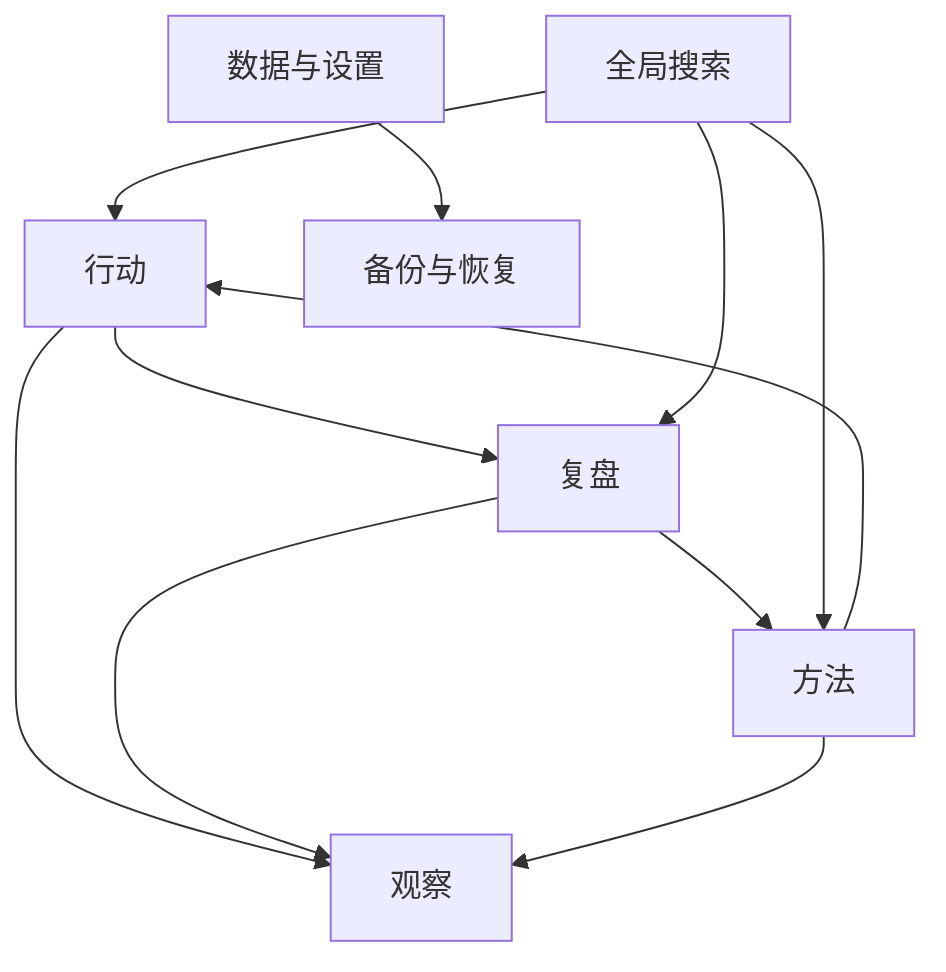

# 个人系统整体布局设计 v1

> 状态：当前有效的桌面端布局与信息架构基线；Layout Sprint 1 与 Layout Sprint 2 的冻结范围已实现并验收。
>
> 适用范围：H5 / Web 桌面端优先，同时为未来移动端和小程序保留一致的页面模型。
>
> 产品功能与业务规则以 `功能清单-v3.md` 为准；本文只定义模块划分、导航关系、页面布局和交互层级，不改变现有 Domain、Application、Repository、IndexedDB Schema 和备份格式。

## 一、改版目标

当前系统的核心业务闭环已经成立：

```text
想法
→ 执行
→ 复盘
→ 形成 / 验证 / 修订方法
→ 用方法发起新行动
→ 搜索定位
→ 周期观察
→ 从仪表盘下钻到具体记录
```

现有页面仍按功能开发顺序纵向排列：

```text
项目标题
→ 全局搜索
→ 仪表盘
→ 快速捕获
→ 事项池
→ 数据备份
→ 方法库
```

这种结构适合作为功能演示页，但不适合长期使用。主要问题：

1. 所有模块都使用大卡片和相近视觉权重，页面没有明确主线。
2. 高频行动、周期观察、长期方法资产和低频数据管理混在同一页。
3. 用户依赖纵向滚动寻找功能，模块定位成本高。
4. 快速捕获占用过多首屏空间，不够“快速”。
5. 方法以固定高度卡片平铺，内容短时浪费空间，内容长时产生嵌套滚动。
6. 页面标题仍带有 Sprint 演示性质，无法代表完整个人系统。
7. 随着事项和方法增加，单页会持续变长，长期维护性差。

本次布局改版的核心目标：

> 从“所有功能堆在一页”升级为“按工作上下文切换的个人操作系统工作台”。

改版只调整信息架构和界面组合，不改变已经验收的业务规则。

## 二、布局原则

### 1. 按业务对象和使用场景拆分，不按状态拆页面

一级模块按以下结构划分：

```text
行动
方法
观察
数据与设置
```

不拆成独立的“想法页、进行中页、待复盘页、已复盘页”。这些状态属于同一个事项对象，继续在“行动”模块中通过状态筛选和详情推进。

这保持“一件事一条主记录”的产品原则：

```text
同一事项
→ 状态迁移
→ 不复制记录
→ 不在多个模块之间搬运内容
```

### 2. 一个页面只承担一个主要任务

- 行动：捕获、推进、复盘具体事项。
- 方法：查看、比较、追溯和复用方法。
- 观察：周期判断、发现堵塞、从指标下钻。
- 数据与设置：备份、恢复和系统状态管理。

### 3. 高频功能前置，低频功能降级

| 能力 | 使用频率 | 布局位置 |
|---|---:|---|
| 事项推进 | 高频 | 默认模块“行动” |
| 快速捕获 | 高频 | 顶部全局栏，可展开 |
| 全局搜索 | 高频 / 随时 | 顶部全局栏 |
| 方法查看与复用 | 中频 | 独立“方法”模块 |
| 周期仪表盘 | 周期使用 | 独立“观察”模块 |
| 备份与恢复 | 低频但重要 | “数据与设置”模块 |

重要不等于必须常驻首页。备份必须可靠，但不应持续占据行动工作区。

### 4. 列表负责定位，详情负责理解和操作

事项和方法统一采用主从工作台：

```text
左侧：筛选 + 列表
右侧：当前选中记录详情 + 操作
```

列表只展示用于定位和比较的信息，不把完整正文、所有操作和历史全部塞入每一行。

### 5. 默认紧凑，按需展开

以下内容默认收起或紧凑显示：

- 快速捕获完整表单
- 单事项流转历史
- 方法版本历史
- 来源复盘证据
- 仪表盘指标下钻记录
- 恢复确认和安全说明

避免系统在默认状态下同时展开所有能力。

### 6. 减少卡片嵌套

卡片只用于表达独立信息组或浮层，不再作为所有内容的默认容器。

保留卡片的场景：

- 仪表盘指标
- 重要提醒和空状态
- 快速捕获展开面板
- 恢复确认
- 搜索浮层

改用列表、分隔线和背景层级的场景：

- 事项列表
- 方法列表
- 搜索结果
- 版本历史
- 详情字段
- 页面导航

## 三、整体信息架构

```text
个人系统
├── 全局能力
│   ├── 全局搜索
│   └── 快速捕获
├── 行动
│   ├── 状态筛选
│   ├── 事项列表
│   ├── 事项详情
│   ├── 状态流转历史
│   └── 复盘工作台
├── 方法
│   ├── 方法搜索与排序
│   ├── 方法列表
│   ├── 方法详情
│   ├── 方法版本与证据
│   └── 用方法发起行动
├── 观察
│   ├── 周期窗口
│   ├── 运行指标
│   ├── 当前堵塞
│   ├── 方法复利
│   ├── 事实提示
│   └── 指标下钻
└── 数据与设置
    ├── 本地数据状态
    ├── 完整 JSON 导出
    ├── 恢复前安全备份
    └── 从备份恢复
```

业务流与页面模块关系：



## 四、桌面端应用骨架

桌面端使用“左侧一级导航 + 顶部全局栏 + 主工作区”。

```text
┌──────────────┬────────────────────────────────────────────┐
│ 个人系统     │ 当前模块       搜索记录       ＋ 快速捕获 │
│              ├────────────────────────────────────────────┤
│ ● 行动       │                                            │
│   方法       │                                            │
│   观察       │                 主工作区                   │
│              │                                            │
│ 数据与设置   │                                            │
│              │                                            │
│ ● 本地正常   │                                            │
└──────────────┴────────────────────────────────────────────┘
```

### 1. 左侧导航

建议宽度：`200px–240px`。

包含：

- 系统名称
- 行动
- 方法
- 观察
- 数据与设置
- 本地数据状态

约束：

- 一级导航只负责定位，不承载完整统计数据。
- 当前模块必须有明确选中状态。
- “数据与设置”与三个业务模块保持视觉分组。
- 底部只持续显示简洁状态，例如“本地数据正常”。

### 2. 顶部全局栏

建议高度：`56px–64px`。

包含：

- 当前模块标题或上下文
- 全局搜索入口
- 快速捕获入口

约束：

- 全局栏保持固定或粘性定位。
- 搜索和捕获在任何一级模块中都可使用。
- 不保留原有 `SPRINT 2 · 复盘与方法` 和营销式大 Hero。
- 产品理念不占据长期工作台首屏，可放入关于说明或首次使用引导。

### 3. 主工作区

建议桌面最大宽度：`1280px–1440px`，在大屏下优先利用横向空间。

工作区使用视口高度，而不是为事项和复盘设置固定 `680px / 760px` 高度。目标形式：

```text
主工作区高度 = 视口高度 - 顶部全局栏 - 必要外边距
```

列表与详情可独立滚动，避免整个页面无限向下增长。

## 五、“行动”模块布局

“行动”是默认首页和最高频工作区。

```text
┌──────────────────────┬──────────────────────────────────────┐
│ 行动 · 8             │ 当前事项                             │
│                      │                                      │
│ 全部              8  │ 想再学习土豆炒肉                     │
│ 想试试            2  │ 已暂停                               │
│ 进行中            1  │                                      │
│ 待复盘            1  │ 补充说明                             │
│ 已复盘            3  │ ……                                   │
│ 以后再说          1  │                                      │
│                      │ 流转历史                             │
│ ───────────────────  │                                      │
│ 事项 A               │                         恢复执行     │
│ 事项 B               │                         放弃         │
│ 事项 C               │                                      │
└──────────────────────┴──────────────────────────────────────┘
```

### 1. 左侧事项区

包含：

- 当前结果数量
- 全部事项 / 回收站入口
- 状态筛选
- 事项列表
- 必要时分页

事项列表每行建议展示：

```text
标题
正文摘要或最近状态说明
状态 · 更新时间
```

约束：

- 状态筛选保持紧凑，不再用多个大型按钮组占据较多高度。
- 当前选中事项有明确背景或边线。
- 列表只负责定位，不在每行放置主要业务操作。
- 默认继续按更新时间倒序。

### 2. 右侧事项详情

按内容优先级展示：

1. 标题、当前状态、创建和更新时间。
2. 补充说明。
3. 方法应用上下文（如果该事项由方法发起）。
4. 当前状态允许的操作。
5. 待复盘 / 已复盘内容。
6. 单事项流转历史默认折叠，以事项详情区右侧浮动抽屉展示，不进入正文文档流。
7. 删除等危险操作，视觉降级并与主操作分开。

### 3. 复盘工作台

复盘仍位于事项详情内，不拆成独立主记录页面。

保持当前已验收字段：

```text
结果怎样

□ 有效 / 舒服
□ 阻力 / 不舒服
□ 产生新想法
```

方法处理仅提供“形成新方法”与“验证已有方法”两个互斥选择；两项均未选择即不处理方法。由方法发起的事项进入待复盘时，默认建议验证来源方法并展示冻结使用版本；用户可以取消或改选其他方法，原方法应用关系不改变。

## 六、快速捕获布局

快速捕获从整块常驻大表单改为“默认紧凑，点击展开”。

### 1. 默认状态

```text
┌────────────────────────────────────────────────────────────┐
│ ＋ 记下一个想法……                                         │
└────────────────────────────────────────────────────────────┘
```

也可以在顶部全局栏表现为：

```text
＋ 快速捕获
```

### 2. 展开状态

```text
┌────────────────────────────────────────────────────────────┐
│ 一句话标题                                                 │
│ 补充说明（可选）                                           │
│                                加入以后再说  加入想试试    │
└────────────────────────────────────────────────────────────┘
```

交互规则：

- 保留“只填补充说明，首行自动成为标题”。
- 创建成功后自动收起并清空。
- 取消时不产生数据。
- 第一轮优先采用顶部展开面板，不急于引入复杂抽屉系统。
- 继续优先使用 `View + Text` 构建自定义交互控件，避免重新引入已知不稳定的 Taro `Button` 样式。

## 七、“方法”模块布局

方法库由双列固定高度卡片改为“左侧列表 + 右侧详情”。

这是本次布局重构的核心变化。

```text
┌──────────────────────────┬──────────────────────────────────┐
│ 方法库 · 3               │ 当前方法                         │
│                          │                                  │
│ 搜索方法……               │ 打招呼                           │
│ 最近更新 / 验证最多      │ v2 · 已验证 3 次                 │
│                          │                                  │
│ 打招呼                   │ 具体步骤                         │
│ v2 · 验证 3 次           │ 嘴角微笑，然后打招呼             │
│ 嘴角微笑，然后打招呼     │                                  │
│                          │ 补充说明                         │
│ 怎么说呢                 │ 和别人打招呼的情况               │
│ v1 · 验证 1 次           │                                  │
│ ……                       │ 来源与证据                       │
│                          │                                  │
│ 番茄炒蛋                 │ 版本历史                         │
│ v1 · 验证 1 次           │                                  │
│ ……                       │             用此方法发起行动     │
└──────────────────────────┴──────────────────────────────────┘
```

### 1. 方法列表

每行只显示用于定位和比较的信息：

```text
方法名称
版本 · 验证次数 · 最近更新时间
具体步骤首行摘要
```

约束：

- 不在每一行重复展示完整步骤和补充说明。
- 不在每一行放“用此方法发起行动”主按钮。
- 当前选中方法必须有明确选中状态。
- 局部搜索覆盖方法名称、具体步骤、适用说明与不适用情况；搜索结果不含当前选择时清空右侧详情选择。
- 列表按最近更新时间倒序稳定排序；并以标题、方法 ID 作为同一更新时间下的稳定兜底。
- 不引入标签、分类树和文件夹。

### 2. 方法详情

按价值顺序展示：

#### 当前可执行内容

- 方法名称
- 当前版本
- 验证次数
- 具体步骤
- 补充说明

#### 发起行动

- “用此方法发起行动”作为详情中的主要操作。
- 点击后在详情内展开紧凑表单，或复用全局捕获面板并带入方法上下文。
- 创建事项时继续冻结实际使用的方法版本。

#### 证据与演化

- 来源与验证证据
- 版本历史

来源与验证证据默认折叠。其关系类型只消费结构化读模型：形成、验证、修订或历史关系未知；关系未知必须明确显示“关系类型无法从旧数据中确定”，不得从时间、文案、版本号或验证次数推断。版本历史默认折叠。展开后按版本倒序展示，不默认铺开全部来源复盘正文。

### 3. 定位行为

从其他模块定位方法时：

```text
全局搜索 / 仪表盘下钻
→ 切换到“方法”模块
→ 在左侧列表中选中目标方法
→ 右侧显示方法详情
→ 仅当存在可靠结构化版本号时展开目标历史版本
```

不再通过滚动页面寻找 `method-card`。

## 八、“观察”模块布局

仪表盘从行动首页移出，成为独立“观察”模块。

```text
┌─────────────────────────────────────────────────────────────┐
│ 系统观察                         7 天｜30 天｜全部           │
├─────────────────────────────────────────────────────────────┤
│ 新增事项  进入执行  完成复盘  形成方法  验证  修订  再行动  │
├────────────────────────────┬────────────────────────────────┤
│ 当前堵塞                   │ 方法复利                       │
│                            │                                │
├────────────────────────────┴────────────────────────────────┤
│ 指标下钻记录                                                │
├─────────────────────────────────────────────────────────────┤
│ 事实提示                                                    │
└─────────────────────────────────────────────────────────────┘
```

规则：

- 仪表盘进入该模块后默认展开，不再以折叠大卡片占据行动页面。
- 保留 `7d / 30d / all` 窗口。
- 七类指标与下钻记录继续使用同一窗口数据。
- 堵塞条目点击后切换到“行动”模块并应用对应状态筛选。
- 方法复利点击后切换到“方法”模块并选中目标方法。
- 下钻结果在观察模块内展开，点击后再进入对应业务模块。

## 九、全局搜索布局

全局搜索从独立常驻大卡片改为顶部搜索栏或搜索入口。

```text
🔍 搜索事项、复盘和方法
```

输入后在搜索框下方显示浮层：

```text
┌──────────────────────────────────────────────┐
│ 学习                                         │
├──────────────────────────────────────────────┤
│ 事项                                         │
│ 我想学习画画                    以后再说      │
│ 想再学习土豆炒肉                已暂停        │
├──────────────────────────────────────────────┤
│ 复盘                                         │
│ 我想学做饭……                                │
├──────────────────────────────────────────────┤
│ 方法                                         │
│ 学习前先定义最小动作            v2           │
└──────────────────────────────────────────────┘
```

定位规则：

- 事项结果：切换到“行动”，清除不兼容筛选并选中事项。
- 复盘结果：切换到“行动”，选中来源事项并定位复盘区域。
- 方法结果：切换到“方法”，选中方法；历史版本结果按需展开对应版本。

后续可以增加 `Ctrl / Cmd + K`，但不作为第一轮重构的必要条件。

## 十、“数据与设置”模块布局

备份与恢复从行动长页面移入独立低频模块。

建议结构：

```text
数据与设置

本地数据状态
- 当前有效事项
- 当前方法
- 回收站数量
- 数据仅保存在当前浏览器

数据备份
- 导出完整 JSON 备份
- 建议每周和重大升级前导出

数据恢复
- 选择备份文件
- 恢复前自动下载当前数据安全备份
- 校验失败或安全备份交付失败时禁止覆盖
```

规则：

- 保留当前完整 JSON 备份和事务恢复能力。
- 不因布局重构修改备份格式。
- 恢复属于高风险操作，必须保留确认步骤和错误说明。
- 左侧导航底部可以持续显示“本地数据正常”，但不持续展示完整备份控件。

## 十一、视觉层级规范

### 1. 颜色

保留当前米白、深灰、低饱和绿色的总体方向。当前主要问题不是配色，而是层级和空间使用。

颜色职责：

- 深灰：主文字和主要操作。
- 米白：应用背景和次级区域。
- 白色：主要内容面。
- 绿色：正常、本地安全、正向状态。
- 红色或棕红：删除、覆盖恢复等危险操作。
- 状态色保持克制，不使用大面积高饱和背景。

### 2. 圆角

建议收紧：

```text
主面板：10px–12px
普通控件：6px–8px
列表行：0–8px
浮层 / 模态框：12px–16px
```

避免所有层级统一使用 `20px` 大圆角。

### 3. 阴影

阴影只表达悬浮关系：

- 普通主工作区：无阴影或极轻阴影。
- 搜索浮层：轻阴影。
- 模态框和恢复确认：明显阴影。
- 普通列表和详情：使用边框、分隔线和背景层级。

### 4. 标题层级

移除长期工作台中的 Sprint 标识和 `42px` 营销式标题。

建议：

```text
一级模块标题：24px–28px
详情主标题：22px–26px
区块标题：14px–16px
辅助说明：12px–13px
```

标题优先说明当前工作上下文：

```text
行动
8 条有效事项 · 1 条待复盘
```

### 5. 信息密度

建议：

- 列表行高：`64px–80px`。
- 顶部全局栏：`56px–64px`。
- 左侧导航：`200px–240px`。
- 常规区块间距：`12px–20px`。
- 详情正文使用自然高度，不用固定大卡片制造空白。
- 避免页面滚动与多个固定高度卡片内部滚动同时存在。

## 十二、响应式与移动端

### 1. 桌面端

建议断点：大于 `900px`。

- 左侧一级导航常驻。
- 行动和方法采用列表—详情双栏。
- 主工作区使用视口高度。
- 搜索结果使用顶部浮层。

### 2. 平板端

建议断点：`600px–900px`。

- 左侧导航可收窄或改为顶部模块切换。
- 列表与详情仍可双栏，但缩小列表宽度。
- 复杂复盘表单必要时改为单栏。

### 3. 移动端 / 未来小程序

小于 `600px` 时：

一级导航改为底部导航：

```text
行动｜方法｜观察｜设置
```

列表—详情改为页面推进：

```text
事项列表 → 事项详情 → 复盘编辑
方法列表 → 方法详情 → 版本历史
```

规则：

- 移动端不强行保留桌面三栏。
- 返回操作必须回到原列表和原筛选上下文。
- 全局搜索和快速捕获放在顶部或独立浮层。
- 页面模型保持与桌面端一致，只改变空间组合方式。

## 十三、状态与导航模型建议

布局重构初期可以先在当前页面内通过 React 状态切换模块，不急于引入复杂路由。

建议概念状态：

```ts
type PrimaryModule = 'actions' | 'methods' | 'insights' | 'settings'
```

同时保留：

- `selectedItemId`
- `selectedMethodId`
- 当前事项状态筛选
- 当前仪表盘窗口
- 当前搜索定位目标

跨模块定位必须通过统一操作完成：

```text
定位事项
→ activeModule = actions
→ 清除回收站或不兼容筛选
→ selectedItemId = target

定位方法
→ activeModule = methods
→ selectedMethodId = target

定位仪表盘堵塞状态
→ activeModule = actions
→ filter = targetStatus
```

当未来真正拆分为多个 Taro 页面或路由时，再将这些上下文映射到路由参数。第一轮改版避免同时重构布局、业务服务和路由体系。

## 十四、实施顺序

整体布局改造分三步，不一次性重写全部 JSX 和业务逻辑。

### Layout Sprint 1：建立应用骨架

目标：解决“全部功能堆在一页”。

范围：

1. 建立左侧一级导航和顶部全局栏。
2. 增加行动、方法、观察、数据与设置四个模块切换。
3. 将现有区块移动到对应模块，暂不重写内部业务逻辑。
4. 移除旧 Sprint Hero。
5. 行动模块成为默认模块。
6. 保持搜索、仪表盘下钻和方法定位能力可用。
7. 保持所有 Domain、Application、Repository 和备份行为不变。

验收：

- 用户不再通过长页面滚动寻找一级功能。
- 四个模块边界明确。
- 所有原有功能仍能到达和操作。
- 搜索、仪表盘下钻可正确切换模块并定位记录。

### Layout Sprint 2：方法列表—详情

目标：解决方法卡片浪费空间和难以扩张的问题。

范围：

1. 双列固定高度卡片改为左侧方法列表。
2. 点击方法后在右侧显示详情。
3. 版本历史和来源证据默认折叠。
4. “用此方法发起行动”移入方法详情。
5. 从搜索和仪表盘定位方法时直接选中对应方法。
6. 移除方法卡片内部固定高度和嵌套滚动。

验收：

- 三条和更多方法都能紧凑浏览。
- 列表可以快速比较方法名称、版本和验证次数。
- 详情完整展示当前方法、版本历史和行动入口。
- 方法发起行动仍冻结实际使用版本。

### Layout Sprint 3：紧凑化与响应式

目标：完成长期工作台体验。

范围：

1. 快速捕获默认收起，按需展开。
2. 全局搜索改为顶部搜索浮层。
3. 主工作区改为视口高度。
4. 减少圆角、阴影和卡片嵌套。
5. 完善桌面、平板和移动端布局。
6. 统一空状态、加载状态、危险操作和选中状态。

验收：

- 首屏直接进入行动上下文。
- 高频操作不依赖长距离滚动。
- 桌面端列表和详情可独立浏览。
- 移动端可通过页面推进完成相同业务闭环。

## 十五、改版边界

本轮布局方案明确不做：

- 不改变事项、复盘和方法业务字段。
- 不恢复 `功能清单-v1.md` 中已被废弃的旧输入项。
- 不修改 IndexedDB Schema 和 JSON 备份格式。
- 不为布局重构直接引入标签、分类树和复杂排序。
- 不同时启动关于我、长期方向和年月周计划。
- 不同时启动 CloudBase、多设备同步或 AI。
- 不为了拆模块复制事项数据。
- 不让页面直接操作 Dexie。
- 不一次性引入复杂路由、全局状态库和新 UI 组件库。

## 十六、最终目标

最终系统应从以下形态：

```text
一个不断变长的功能集合页
```

升级为：

```text
应用外壳
├── 顶部：全局搜索 + 快速捕获
├── 行动：状态筛选 + 事项列表 + 事项 / 复盘详情
├── 方法：方法列表 + 方法 / 版本 / 证据详情
├── 观察：周期指标 + 堵塞 + 方法复利 + 下钻
└── 数据与设置：导出 + 恢复 + 本地数据状态
```

核心判断标准：

> 首页不再展示整个系统，而只展示用户此刻要工作的上下文。

布局服务业务闭环，而不是重新发明业务闭环；模块分开是为了降低定位成本，事项状态仍然属于同一条主记录，方法详情仍然来自真实复盘证据，所有视觉与交互调整最终都必须服务判断和下一步行动。
